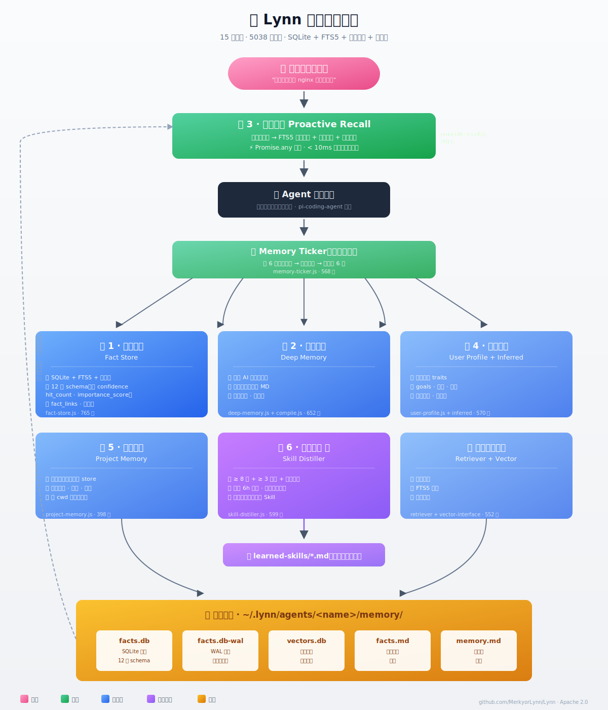
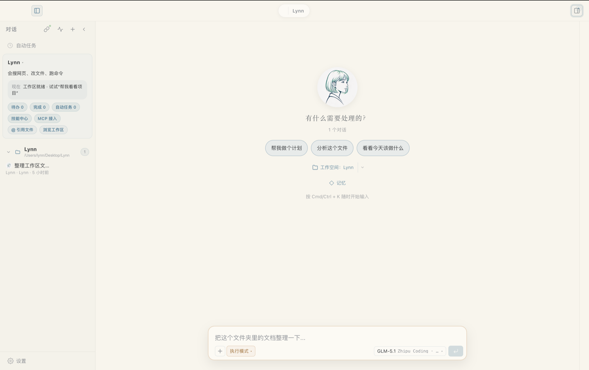

[English](README_EN.md) | **中文**

<p align="center">
  
</p>

<p align="center">
  
</p>

<h1 align="center">Lynn</h1>

<p align="center"><strong>有长期记忆 · 会写作 · 多 Agent 协作 · 零 API Key 开箱即用</strong></p>
<p align="center">首个真正让<em>非程序员</em>也能用起来的开源桌面 AI Agent</p>

<p align="center">
  <a href="LICENSE"></a>
  <a href="https://github.com/MerkyorLynn/Lynn/releases"></a>
  <a href="https://github.com/MerkyorLynn/Lynn/stargazers"></a>
  <a href="https://github.com/MerkyorLynn/Lynn/releases"></a>
  <a href="https://www.typescriptlang.org/"></a>
  <a href="https://www.electronjs.org/"></a>
</p>

---

## 🆕 近期更新

<details>
<summary><strong>v0.76.9</strong> · 2026-04-28 · DeepSeek v4 + 路由重排 + brain 工具兜底 + UI 流式修复 <em>(最新)</em></summary>

**模型 / 路由 ABD 重排**:
- 🚀 **DeepSeek API 升级**:`deepseek-chat` → `deepseek-v4-flash`(非思考),`deepseek-reasoner` → `deepseek-v4-flash`(思考模式,带 `thinking:{type:"enabled",reasoning_effort:"high"}`),新增 `deepseek-v4-pro` provider(brain 可路由)。
- 🧠 **thinking 字段强制声明**:v4-flash 默认会进 thinking 烧 token,brain chat 链路注入 `thinking:{type:"disabled"}`,reasoner 链路注入 `enabled+high`,不再返回空内容 finish=length。
- 🛣️ **chatOrder 重排**:Spark FP8 第 1(轻任务本地优先) → 4090 by D-wrapper → DeepSeek V4-flash → GLM/MiniMax/Step → K2.6 倒数第 2 → K2.5 末位。
- 📚 **新 creativeOrder**(小说/章节/古风/散文/诗歌/文学翻译/润色/文风/写一篇)→ DeepSeek V4-pro 第 1 + K2.6 第 2 + GLM-5-Turbo。
- 📜 **complexLongOrder K2.6 第 1**(超长上下文 200K+ 唯 K2.6 支持)→ V4-pro → V4-flash → 兜底链。
- 📦 **客户端 BYOK 兼容**:`lib/known-models.json` + `lib/default-models.json` 加 v4-flash/v4-pro 条目,旧名标 `deprecated:true + alias`。

**brain 工具链与超时兜底**:
- 🛠 **stock_research NaN sanitize**:Tushare 偶发输出非法 JSON `:NaN/:Infinity`,parse 前自动替换为 `:null`,不再触发 90s LLM fallback chain。
- ⏱ **web_search 25s 总 budget**:多源 race(DDG+Zhipu)+ WeChat+SearXNG fallback 全程不超过 25s,超时返回空让模型基于上下文回答。
- 🚫 **HK bail v2 严格 A 股代码白名单**:tsCode 必须 `60/00/30/68/8X/92.SH/SZ/BJ`,其余(89xxxx 基金 / 4 位 HK code / 美股)直接 bail 到 stock_market,**修"HK 700 → 890001 伪报告" bug**。
- 📊 **dataChunks guard**:深度研究上下文如果实测拿到 0 段真数据,**不再硬撑专业报告模板**误导用户,直接告知"未拿到真实数据,请改用普通查询"。
- 🌐 **realtime-info 多源补强**:金价 / 油价 / 行情等查询源补足,失败时清晰告知。

**UI / 客户端流式修复**:
- 🔤 **\</user> chat-template tag 不再漏到 UI**:streaming chunk 边界把 `</user>` 切成 `</us` + `er>` 时,加 buffer 缓冲到下一 chunk 拼接,ORPHAN_CLOSE_TAG_RE 才能正确命中 strip。
- 🛎 **慢工具进度提示**:工具调用 > 15s 自动 emit `tool_progress slow_warning` event,UI 不再"卡死"感。
- 🧰 **bash schema 三层兜底**:`extractToolDetail` + `TOOL_ARG_SUMMARY_KEYS` + `normalizeToolArgsForSummary` 全部加 `cmd/shell/script` 别名,Spark emit `{cmd:"..."}` 不再渲染成空 "执行 命令"。
- 🎤 **录音权限 ghost 检测**:录够 0.4s+ 但 blob<1KB 时识别为 macOS TCC 失效,提示用户去系统设置重授权 + 重启 app。
- 🔏 **install:local 不再丢权限**:sign-local.cjs 默认 Developer ID 而不是 ad-hoc,cdhash 跟 electron-builder 一致,**以后 install:local 不再让 macOS TCC 把 Lynn.app 当新 app**。
- 🎙️ **PressToTalk UI 优化**:按钮样式 + 状态机重构,长按锁定 + 录音中视觉反馈更稳。
- 🧱 **brain server 报告上下文增强**:`server/chat/report-research-context.js` 注入更结构化数据,模型生成报告更准确。

[完整 Release Notes →](https://github.com/MerkyorLynn/Lynn/releases/tag/v0.76.9)

[完整 Release Notes →](https://github.com/MerkyorLynn/Lynn/releases/tag/v0.76.9)

</details>

<details>
<summary><strong>v0.76.8</strong> · 2026-04-27 · BYOK-equality + Spark FP8 回退 + 文件管理修复 + bash schema 兜底 + 录音权限提示</summary>

**Hotpatch #3 (2026-04-28 凌晨)**:
- 🛠️ **bash 工具 schema 一致**:`extractToolDetail` / `TOOL_ARG_SUMMARY_KEYS` / `normalizeToolArgsForSummary` 全部加 `cmd/shell/script` 别名兜底,Spark emit `{cmd:"..."}` 不再渲染成空 "执行 命令"。
- 🎤 **录音权限友好提示**:录够 0.4s+ 但 blob<1KB 时识别为 macOS 麦克风 TCC ghost 失效,直接提示去系统设置重新授权 + 退出重开。
- 🔏 **install:local 不再丢权限**:`sign-local.cjs` 默认 Developer ID 而不是 ad-hoc,签名后 cdhash 跟 electron-builder 一致,**不再让 macOS TCC 把 Lynn.app 当新 app 让用户每次重装都重新授权**。
- 📝 **brain 长答稳定**(server-side):`max_tokens` simple 1500→4000 / longForm 6000→8000;`__longFormRx` 加"介绍/说说/讲讲/写一段/简介/教程..."等中文长答关键词;`temperature` 0.6→0.4 让重问同问题输出更一致。


- 🚨 **Spark 紧急回退 PRISM-NVFP4 → Qwen3.6-35B-A3B-FP8 + SGLang+MTP**: heretic 去 safety 流程附带破坏 tool-call decisiveness,curl 实锤 reasoning 死循环 2048 tok 不出 tool_call;FP8 + `首先` 注入 + NEXTN MTP 即时恢复。
- 🧠 **BYOK-equality 架构改造**: Lynn 客户端不再用"场景契约 + 预取 + 强制工具"抢方向,brain 跟 BYOK(GPT/Claude/Kimi)走同一套自主判断路径。
- 🔧 **文件管理任务分类修复**: "新建/移动/挪/整理 + 文件夹/目录/图片" 强制走 UTILITY/local_automation,不再被裸"图片"误判成 vision/multimedia。
- 🛡️ **brain 6 patches**(server.js): HYBRID-1 hasGpuTools→max=32K + HYBRID-3 reasoning guardrail + B1 `__needsFileTools` + B2 收紧 `__isFileEditIntent` + LYNN BYOK-equality + loop-breaker v4(只 log 不强制干预,允许合法多步 ls→mkdir→mv)。
- 🤖 **新模块 LLM Triage v1**: regex+Spark FP8 hybrid 分类器,5min cache,Spark 不可达自动 fallback regex。
- 🛠️ **bash args 归一**: tool-wrapper 自动把 query/cmd/shell/script 归一成 command,Spark 偶发 schema 错位有救。
- 🎤 **录音 min-size guard**: PressToTalkButton 拦截 <1KB blob 或 <0.4s 录音,防 sensevoice 500 EBML header 错位。
- ⌨️ **IME 三层 OR**: `isComposing || nativeEvent.isComposing || keyCode === 229`,中文最后一段不再被 Enter 提交时漏字。
- 🔇 **空答兜底**: 模型只 thinking 不出答案 → 显示"重试"按钮(5 locale 已加翻译)。
- 🔠 **i18n**: 设置页 Voice tab 显示"语音"(之前漏 5 个 locale 翻译)。
- 🚫 **伪 tool-call 检测 + 自动恢复**: 模型在 text 里写 `<web_search>...` / `web_search(query=...)` 等"调用语句"时,brain 强切回真工具流,user 不再看到崩溃文本。
- 🧪 **771/771 全测试 + 新增 30 regression cases** 锁住 file-move-image 永不再走 vision 误判。

[完整 Release Notes →](https://github.com/MerkyorLynn/Lynn/releases/tag/v0.76.8)

</details>

<details>
<summary><strong>v0.76.7</strong> · 2026-04-27 · TTS 端到端 + 语音 Phase 1 + CSP media-src 修复</summary>

- 🗣️ **TTS 播放打通**: SenseVoice ASR + CosyVoice 1.0 SFT(7 个内置 speakers),米色 🎤 按钮 → ssh tunnel → frp → DGX docker
- 🎙️ **B 模式长按锁定**: 长按 600ms 锁定连续录音,再点结束
- 🔌 **Provider Registry 框架**: 阿里全家桶默认 + 4 个 BYOK 备选(Faster Whisper / OpenAI Whisper / Azure / Edge TTS)
- 🔧 **CSP media-src 修复**: vite CSP_PROFILES 让 `blob:` URL 能被 Audio 元素加载(本次 release 真凶)
- 🛠️ **vite hono external**: vite.config.server.js 让 plugin 动态 import 解析正常
- 🪟 **IME 不抖**: 中文输入候选切换稳定;thinking block 默认折叠
- 📦 **3 平台公证**: macOS Apple Silicon + Intel + Windows 全打公证,镜像站同步

[完整 Release Notes →](https://github.com/MerkyorLynn/Lynn/releases/tag/v0.76.7)

</details>

<details>
<summary><strong>v0.76.6</strong> · 2026-04-21 · 工具增强 + 研究路径 + OAuth + 715 测试全绿</summary>

- 📈 **stock-market 工具大改** (+425 行): 多数据源行情 + 容错 + 4 个新测试
- 🧠 **研究上下文扩展** (+428 行): 天气/股票数据结构化注入, 融合研究路径
- 🔧 **LLM 客户端重构** (+188 行): provider-aware 请求构建, 多 provider 更稳
- 💭 **ThinkTag/XingParser 扩展**: 思维链解析能力 +5 场景覆盖
- 🔐 **OAuth 路径修复**: Lynn OAuth provider id 正确映射到 auth.json
- 🎯 **串轮隔离 TURN-FENCE v1**: 上一轮 abort 无产出时自动系统隔离, 避免误读残留
- 🧪 **测试**: 4 新 + 7 扩展, `715/715 vitest all green`

[完整 Release Notes →](https://github.com/MerkyorLynn/Lynn/releases/tag/v0.76.6)

</details>

<details>
<summary><strong>v0.76.5</strong> · 2026-04-21 · 乱码清洗 + 办公本地答 + vision arg 修复</summary>

- 乱码清洗机制: LLM 输出偶发乱码字符被拦截
- 办公本地答: 简单办公问题走本地预算计算, 避免 LLM 心算错
- Vision argument regression 修复 (9 tests)
- 工具 intent 收敛: 减少工具误触发

</details>

<details>
<summary><strong>v0.76.4</strong> · 2026-04-20 · ThinkTagParser v2 + FAKE-PROGRESS-GUARD v2 + 25s TTFT timer</summary>

- **ThinkTagParser v2**: 重构思考标签解析, 应对更多模型格式
- **FAKE-PROGRESS-GUARD v2**: 防止 LLM 编造 tool_progress 消息
- **25s TTFT timer**: 首 token 超时降级, 用户体验更稳
- **vLLM 切回真 A3B** (服务器侧): 修复上一版误用稠密模型
- QA 质量分从 1.3 → 4.42

</details>

<details>
<summary><strong>v0.76.3</strong> · 2026-04-19/20 · 真流式 + Diff 视图 + Brain 并发 3×</summary>

- 20 小时马拉松: 真流式重构, brain 10+ 补丁
- **vLLM 调优**: KV 池容量 4×
- **WritingDiffViewer**: 词级红删绿增, 专为写作设计
- **Loop-breaker v2**: 工具调用死循环检测
- **复查路由**: 跨 session 任务追踪

</details>

<details>
<summary><strong>v0.76.2</strong> · 2026-04-18 · Intel 死机修复 + 工具 alias + 中文 thinking</summary>

- 修复 Intel Mac 启动死机
- 工具名 alias 6 条 (read_file → read 等)
- 中文 thinking 命中率 91%
- ThinkingBlock R1 风格呈现

</details>

<details>
<summary><strong>v0.76.1</strong> · 2026-04-17 · 任务模式切换 + 按需 MCP</summary>

- **任务模式芯片**: ⚡ 自动 / 📖 小说 / 🖋️ 长文 / 🌶️ 社媒 / ⌘ 代码 / 💼 商务 / 🌐 翻译 / 🔬 研究 / 📝 笔记
- 社媒模式 7 个 slash 命令 (`/xhs` `/gzh` `/weibo` `/douyin` `/zhihu` `/hashtags` `/titles`)
- **按需激活 MCP 服务器**: 默认 0 个 MCP 工具, 要用再开, 不拖慢模型
- IME bug 修复
- GPU 64K context 支持

</details>

👉 [完整发版历史 · GitHub Releases](https://github.com/MerkyorLynn/Lynn/releases)

---

## Lynn 是什么

Lynn 是一个面向桌面用户的 AI Agent：**有记忆、有人格、会写作、能主动做事**。

不需要写配置、不需要懂术语、不需要是程序员。如果你是在电脑前工作的普通人——写作者、研究者、运营、学生、创业者——Lynn 为你做了很多重活：把 Coding Agent 从命令行里拖出来，塞进一个温柔好用的图形界面，再围绕"日常办公 + 写作"补齐了 Agent 最缺的那层人味。

用过 Claude Code / Codex / Manus / Cursor 的，你会觉得熟悉。没用过的，你会觉得**这就是 AI 应该有的样子**。

## Lynn 适合谁 / 不适合谁

**✅ 适合**

- 写作者（网文 / 公众号 / 小红书 / 知乎 / 论文）
- 研究员 / 学生党（整资料、跟项目进度、长期记忆）
- 运营 / 创业者（跨平台同步、多 Agent 分工、批量文案）
- 需要 **"AI 帮我处理本地文件"** 的非技术用户
- 想要一个**桌面端 AI 伙伴**的人（而不是浏览器标签页）

**❌ 不适合**

- 只想要代码补全 → 用 [Cursor](https://cursor.com) / [Trae](https://trae.ai)
- 只用 CLI → 用 [Claude Code](https://claude.com/claude-code) / [Gemini CLI](https://github.com/google-gemini/gemini-cli)
- 部署在服务器做多租户 → 用 [Hermes Agent](https://github.com/NousResearch/hermes-agent)

Lynn 做的是**桌面端、面向个人、有长期记忆、会写作**的 AI Agent。编程工具赛道有太多选择了，我们填的是**非程序员**这块空白。

## 三个和别家不一样的地方

### 🧠 1. 真正的长期记忆（不是 `memory.md` 那种）

Lynn 的记忆层是 **15 个模块、5000+ 行代码、SQLite + FTS5 全文索引 + 向量检索 + 关系图**。

<p align="center">
  
</p>

- **毫秒级召回**："你上个月是怎么配 nginx 的来着" —— FTS5 在 10ms 内翻出三条相关对话
- **六层结构**：事实存储 / 深层记忆 / 用户画像 / 项目记忆 / 主动召回 / **技能蒸馏**
- **主动召回**：不等你问，根据当前对话关键词**自动把相关记忆注入上下文**
- **技能蒸馏**：复杂任务完成后（≥8 轮 + ≥3 次工具调用 + 检测到"完成"信号）自动提炼成可复用 Skill，冷却 6h 防抖，带中英双语完成/失败模式识别

### ✍️ 2. 专为写作做的 Diff 视图

大部分 Agent 改 Markdown 像改代码——给你一坨 `+/-` 行级对比。Lynn 不是。

- **WritingDiffViewer**：词级红删绿增、比例字体、逐段 ✓接受 ✗拒绝
- **✎ 手改**：不满意 AI 的版本，直接在段落里改成自己的
- **写作模式**：⇧⌘M 一键切换，聊天区加宽到 800px，右侧自动开 MD 预览，左侧 sidebar 自动收起
- **多视角叙事**：novel-workshop 技能支持罗生门式同场景多 POV 重写
- **对比外部修改**：你在 VSCode 里改了文件？点「对比外部修改」→ git HEAD diff → 同样的 WritingDiffViewer

写小说、写长文、写公众号、写小红书——散文友好，不是 GitHub 那套。

### 🎯 3. 任务模式切换（v0.76.1 新增）

输入框左下角的 ⚡ 芯片，点开一看就懂：

| 类别 | 模式 | 干什么 |
|---|---|---|
| 自动 | ⚡ 自动 | 按文件/内容自动选（默认） |
| 写作 | 📖 小说 · 🖋️ 长文 · 🌶️ 社媒 | 每个模式注入专属 persona |
| 工作 | ⌘ 代码 · 💼 商务 · 🌐 翻译 | |
| 学习 | 🔬 研究 · 📝 笔记 | |

**社媒模式自带 7 个 slash 命令**：`/xhs` `/gzh` `/weibo` `/douyin` `/zhihu` `/hashtags` `/titles`——点一下展开完整 prompt 模板，你只需要填主题。

同一个面板里还能 **按需激活 MCP 服务器**（v0.76.1 新增）——默认 0 个 MCP 工具（不拖慢模型），要用哪个点开关就行。

---

## 和 Cursor / Claude Code 横比

|  | **Lynn** | Cursor | Claude Code |
|---|---|---|---|
| 定位 | **普通人桌面 Agent** | 程序员 IDE | 程序员 CLI/IDE |
| 长期记忆 | **✓ 6 层自动持久化** | session 级 | session 级 |
| 写作支持 | **✓ 词级 Diff 视图** | ✗ 只做代码 | ✗ 只做代码 |
| 中文优化 | **✓ 深度适配** | 一般 | 一般 |
| 零 Key 可用 | **✓ 内置 Brain** | ✗ 要订阅 | ✗ 要 Claude Key |
| 多 Agent + 人格 | **✓ Yuan 模板** | ✗ | ✗ |
| 微信/飞书 Bridge | **✓ 原生** | ✗ | ✗ |
| 开源协议 | **Apache 2.0** | 闭源商业 | 闭源商业 |
| 平台 | Mac + Win | Mac + Win + Linux | Mac + Win + Linux |

**Lynn 不替代 Cursor**——如果你是程序员，写代码继续用 Cursor。Lynn 接手 **所有写代码以外的工作**：写周报、回邮件、做调研、整理笔记、写文案、跟团队同步。

一个打工人两个工具，合理分工。

---

## 开箱即用，零配置

首次启动有两条路径：

**Quick Start**（3 秒进主界面）— 输入名字、授权权限，直接开聊。**内置免费默认模型池**：

```
T1  GPU Qwen3.6-35B-A3B AWQ-4bit（128K 窗口，自建 vLLM 推理）
T2  Moonshot Kimi K2.5（256K 窗口）
T3  智谱 GLM-4.7
T4  智谱 GLM-5.0-Turbo
T5  DeepSeek V3.2
T6  Step-3.5 Flash / MiniMax M2.5
```

六级降级自动切换：某档不可用 → 自动下一档，对话不中断。**默认模型有工具调用能力**（Plan C 透传，可以直接跑 `write` / `edit` / `read` / `bash`），不只是聊天。

**隐私三条承诺**：不训练、不落盘、日志最小化。想要绝对隐私？三种逃生路径：
- 全程 Ollama 本地模型（无任何数据出门）
- 自备 OpenAI / Anthropic / Moonshot 等 API Key（走你自己的账号）
- 敏感工作区路径隔离（`.lynn/private/*` 不进记忆）

**Advanced Setup** — 想接自己的 provider？OpenAI 兼容协议全支持，7 家国产 Coding Plan（百炼/智谱/Kimi/MiniMax/阶跃/腾讯云/火山引擎）预注册，填 Key 即用。

界面支持 **5 种语言**：zh / en / ja / ko / zh-TW。

---

## 不是工具，是伙伴

Lynn 不是千篇一律的"AI 助手"。每个 Agent 有自己的名字、性格和说话方式，通过人格模板（Yuan）塑造——有的温柔细腻，有的理性冷静，有的活泼跳脱。

你可以创建多个 Agent，各自独立运行，**互相委派任务、频道群聊协作**。Agent 就是一个文件夹，备份和迁移都很简单。

连接 **Telegram / 飞书 / 企业微信 / QQ / 微信机器人** 后，同一个 Agent 可以同时在多个平台和你对话，甚至远程操作你的电脑。跨平台身份一致、不泄露底层模型（被问"你是 GPT 吗"会答"我是 Lynn"）。

---

## 不在的时候也在干活

这是 Lynn 与对话型 AI 工具最本质的区别。

**书桌（Desk）** 是你和 Agent 之间的异步协作空间。每个 Agent 都有自己的书桌，你可以放文件、写笺（Jian，类似便签）。写在笺上的待办事项，Agent 会主动读取并执行——你不需要开着对话窗口盯着它。

**心跳巡检（Heartbeat）** 会定期扫描书桌上的文件变化和笺的内容更新。发现新任务就自动处理，处理完了通知你。

**定时任务（Cron）** 让 Agent 按计划重复执行工作。每个 Agent 的 Cron 独立并发运行，切换 Agent 不会中断其他 Agent 的定时任务。笺里写的重复性待办会自动变成 Cron 任务。

**长任务稳定性** 是这套自主工作体系的基础。Lynn 的 server 以独立 Node.js 进程运行（不依赖 Electron 渲染进程），通过 WebSocket 全双工通信。对话中断、窗口关闭、网络波动都不会打断正在执行的任务。

---

## 国内模型深度优化

Lynn 不是简单套 OpenAI 兼容协议。从 9B 小模型到 GLM-5 推理模型，每一级都有针对性适配：

**工具分层（Tool Tiering）** — 按上下文窗口自动裁剪工具集：

| 档位 | 窗口 | 工具策略 |
|---|---|---|
| 小 | <32K（ERNIE / Step 8K 等） | 仅 `web_search` + `web_fetch` |
| 中 | 32K（豆包 / 混元 Pro / 百川 Turbo） | 标准 10 工具 |
| 大 | ≥64K（Qwen3.6 / Kimi K2.5 / GLM-5 / DeepSeek） | 24 工具全开 |

**小模型专属 Prompt 工程** — context < 32K 时自动注入：回复限 500 字 + 关键结论 `<!-- KEY: -->` 标注（压缩时优先保留）；单工具串行调用规则（防弱模型并行错）；3 步以上任务强制先出计划等确认。

**自适应上下文压缩** — 小窗口保留 40% 近期上下文、4K 输出预留；大窗口 20% / 16K；压缩 1-2 次后自动 session 接力（大模型 3 次），防止质量崩溃。

**推理协议适配** — 智谱 GLM-5 系列走 ZAI thinking format（`thinking: { type: "enabled" }`）；Qwen3 全系走 `enable_thinking` quirk；两者走不同的 Pi SDK 补丁路径。

**工具调用容错** — 小模型工具调用连续失败 3 次后自动降级：停工具、用文字说明。空 `tools: []` 自动清理（dashscope / volcengine 不接受空数组会 400）。

---

## Harness 六层架构

Lynn 的核心 Agent 循环外面包裹了六层 harness，每层独立运作，通过共享的数据存储（FactStore SQLite、experience/、memory.md）协同：

```
用户输入
  │
  ├─ [1] Content Filter ── DFA 关键词过滤，17 类风险词库
  ├─ [2] Proactive Recall ─ 关键词 → FactStore FTS5 检索 → 隐形注入上下文
  │
  ▼
┌──────────────────┐
│  Core Agent Loop │  LLM 对话 + 工具调用（Pi SDK）
└──────────────────┘
  │
  ├─ [3] Tool Wrapper ──── 路径校验 + 命令 preflight + 危险操作授权
  ├─ [4] ClawAegis ─────── 工具返回内容的 Prompt Injection 扫描（纯正则，不调 LLM）
  │
  ├─ [5] Memory Ticker ─── 每 6 轮滚动摘要 → 每日深度 → 事实提取 → 技能蒸馏
  ├─ [6] Review System ─── 另一个 Agent 复查输出 → 结构化发现 → 自动修复任务
  │
  ▼
用户输出
```

**反馈闭环**：Review（第 6 层）用第二个 Agent 作"同事 code review"，发现问题自动构建修复任务回注执行链；Memory Ticker（第 5 层）从对话沉淀事实和经验到 FactStore；Proactive Recall（第 2 层）在下一次对话时把这些召回注入上下文。**评估 → 沉淀 → 召回 → 更好的执行 → 再评估**。

**低延迟、不阻断** 是每层的设计底色：Content Filter 用 DFA Trie；ClawAegis 扫描前 10KB 纯正则；Proactive Recall 正则 + SQLite；Memory Ticker 和 Review 都后台异步跑，不阻当前对话。

---

## 插件系统（7 类 contribution）

第三方想加功能**不用 fork 源码**。扔一个文件夹到 `~/.lynn/plugins/`：

```
my-plugin/
├── manifest.json       # 元数据
├── tools/*.js          # 自定义工具（注入 agent）
├── routes/*.js         # HTTP 路由（Hono）
├── commands/*.js       # 斜杠命令
├── skills/             # Skills 目录
├── agents/*.json       # Agent 模板
├── providers/*.js      # 自定义 LLM provider
├── hooks.json          # Lifecycle hooks（before-chat / after-tool 等）
└── index.js            # onload / onunload 生命周期
```

- **动态 import**（Node ESM 热加载，重启即见）
- **Hook 链**语义完整：`before-*` 返回 null 取消、对象替换、undefined 透传
- **disposables** 链：unloadPlugin 时按注册顺序 dispose，零泄漏
- 设置里的 PluginsTab UI 可视化管理

内置示例插件：`plugins/github-watch/`（定时扫 GitHub 仓库并通知）。

---

## 安全防护

Lynn 能读文件、跑命令、操作本地环境，所以安全不是附加功能，而是底座。**四层纵深防御**：

**第一层 · 路径守卫（PathGuard）** — 四级访问控制 `BLOCKED → READ_ONLY → READ_WRITE → FULL`。每次文件操作先 realpath 解析符号链接再匹配。SSH 私钥、`.env`、密码数据库等系统敏感文件硬编码 BLOCKED。工作目录以外默认只读。

**第二层 · 操作系统沙盒** — 终端命令不是直接执行：
- **macOS**：`sandbox-exec` 加载动态生成的 Seatbelt SBPL 策略
- **Linux**：Bubblewrap (`bwrap`) 命名空间隔离
- **Windows**：PathGuard 校验层（无 OS 级沙盒）

**第三层 · Prompt Injection 检测（ClawAegis）** — 外部文件内容的注入扫描：纯正则、零延迟、不调 LLM。覆盖"ignore previous instructions"、"pretend you are"、"read /etc/passwd"等攻击模式。检测到追加警告上下文，不阻断读取。

**第四层 · 行为确认与安全模式** — 三种模式：
- **安全模式**：只读，不写不跑命令
- **规划模式**：可读可写，危险操作暂停确认
- **执行模式**：完全授权，自主决策

危险操作（`rm -rf` / `sudo` / `git push --force`）始终弹确认框，不受模式影响。Skill 安装经独立 AI 安全审查（注入检测、过宽触发、权限提升），不过审则拒装。

---

## 自建 GPU 推理（可选进阶）

如果你有 GPU（或者能租到 vGPU），Lynn 支持把主力模型私有化。Brain 代理已经内置了 vLLM 适配：

- **推荐配置**：Qwen3.6-35B-A3B AWQ-4bit + vLLM + `--max-model-len 131072`（128K 窗口）
- **量化路径**：compressed-tensors + Marlin kernel + FP8 KV cache
- **工具调用**：OpenAI-compat 原生支持，Plan C 客户端工具透传无损
- **智能过滤**：118 个工具按用户意图自动过滤到 ~30 个（避免撑爆 GPU 上下文）
- **成本**：一张 RTX 4090 ≈ 私有 Claude Sonnet 级别的日常体验，**实测 KV 容量 192K tokens**（单 64K 并发 ~3 路，平均 15K 场景 ~12 路）

搭配你的 OpenAI / Anthropic API Key 做降级兜底，就是**真正私有 + 有备援**的 Agent 基础设施。

---

## 工具能力速览

读写文件、执行终端命令、浏览网页、搜索互联网、截图、画布绘图、JavaScript 执行、Cron 调度、Agent 间通信、MCP 服务器……**24 个内置工具**覆盖日常办公绝大多数场景。

**33 个内置 Skills**：
- 写作：`novel-workshop`（小说工作台 v1.4 多 POV）、`humanizer`、`summarize`
- 研究：`deep-research`、`tavily-search`、`brave-search`、`baidu-search`
- 金融：`a-share-scanner`、`quant-scanner`、`stock-analysis`
- 前端：`canvas-design`、`frontend-design`、`image-lightbox`
- 效率：`notion`、`obsidian`、`nano-pdf`、`file-guardian`
- Agent：`agent-personality`、`proactive-agent`、`self-improving-agent`
- 自动化：`automation-workflows`、`blogwatcher`、`youtube-watcher`
- 生态：`github`、`weather`、`memory-recall` 等

Agent 也可以从 GitHub 安装技能或自己编写新技能，安装经独立 AI 安全审查。

---

## 截图

<p align="center">
  
</p>

---

## 快速开始

### 下载安装

**macOS（Apple Silicon / Intel）**：从 [Releases](https://github.com/MerkyorLynn/Lynn/releases) 下载最新 `.dmg`。应用已通过 Apple Developer ID 签名和公证，macOS 直接打开即可。

**Windows**：从 [Releases](https://github.com/MerkyorLynn/Lynn/releases) 下载最新 `.exe`，直接运行。

> **Windows SmartScreen 提示：** 便携版暂未代码签名，首次运行 Windows Defender SmartScreen 可能拦截，点 **更多信息** → **仍要运行** 即可。

Linux 版本计划中。

### 首次运行

- **Quick Start**：输入名字 → 授权 → 进入主界面。默认模型池开箱即用，无需 API Key。
- **Advanced Setup**：输入名字 → 连接自己的供应商 → 选对话/工具模型 → 设权限 → 进入。

所有模型配置后续都可在设置调整。

---

## 架构

```
core/           引擎层（HanaEngine Thin Facade + 10 个 Manager/Coordinator）
lib/            核心库
  ├── memory/     记忆系统（15 个文件，5000+ 行）
  │   ├── fact-store.js        SQLite + FTS5 + 关系图（765 行）
  │   ├── skill-distiller.js   自进化 Skill 提炼（599 行）
  │   ├── memory-ticker.js     每 6 轮滚动摘要（568 行）
  │   ├── vector-interface.js  向量检索（381 行）
  │   ├── proactive-recall.js  主动召回（287 行）
  │   └── retriever.js         标签 + FTS5 + 向量三路融合检索
  ├── tools/      24 个工具（浏览器、搜索、Cron、委派、技能安装等）
  ├── sandbox/    双层沙盒（PathGuard + macOS Seatbelt / Linux Bubblewrap）
  ├── bridge/     社交平台适配器（Telegram / 飞书 / QQ / 微信 / 企业微信）
  ├── desk/       书桌系统（心跳、Cron、笺运行时）
  └── ...         LLM 客户端、OAuth、频道存储、专家系统
shared/         跨层共享
server/         Hono HTTP + WebSocket（独立 Node.js 进程，24 个路由）
hub/            后台调度中枢（event bus、scheduler、channel router、DM 路由）
desktop/        Electron 38 + React 19 + Zustand 5
skills2set/     33 个内置技能定义
plugins/        内置插件（github-watch 等）
scripts/        构建工具（server 打包、启动器、签名）
tests/          Vitest 测试
```

**引擎层**：`HanaEngine` Thin Facade 持有 AgentManager、SessionCoordinator、ConfigCoordinator、ModelManager、PreferencesManager、SkillManager、ChannelManager、BridgeSessionManager、ExpertManager、PluginManager，对外统一 API。

**Hub**：独立于聊天会话运行，负责心跳巡检、Cron（per-agent 并发）、频道路由、Agent 间通信（含防无限循环硬上限 + 冷却期）、DM 路由。

**Server**：独立 Node.js 进程（由 Electron spawn 或独立启动），Vite + @vercel/nft 打包，WebSocket 全双工。

---

## 技术栈

| 层级 | 技术 |
|------|------|
| 桌面端 | Electron 38 |
| 前端 | React 19 + Zustand 5 + CSS Modules |
| 构建 | Vite 7 |
| 服务端 | Hono + @hono/node-server + @hono/node-ws |
| Agent 运行时 | [@mariozechner/pi-coding-agent](https://github.com/badlogic/pi-mono) |
| 数据库 | better-sqlite3（WAL 模式 + FTS5 + 向量搜索） |
| 测试 | Vitest |
| 国际化 | 5 语言（zh / en / ja / ko / zh-TW） |

---

## 平台支持

| 平台 | 状态 |
|------|------|
| macOS (Apple Silicon) | 已支持（已签名公证） |
| macOS (Intel) | 已支持 |
| Windows x64 | Beta |
| Linux | 计划中 |
| 移动端 (PWA) | 计划中 |

---

## 开发

```bash
npm install                   # 装依赖
npm start                     # Electron 启动（自动构建 renderer）
npm run start:vite            # Vite HMR 开发（需先 npm run dev:renderer）
npm test                      # 跑测试
npm run typecheck             # 类型检查
npm run build:server          # 打包 server
npm run dist:local            # 本地打包（macOS DMG，跳过公证）
```

---

## 许可证

[Apache License 2.0](LICENSE)

本项目基于 [liliMozi/openhanako](https://github.com/liliMozi/openhanako) 的开源工作，由 Merkyor 修改和扩展。核心 Agent 运行时使用 [@mariozechner/pi-coding-agent](https://github.com/badlogic/pi-mono)（Apache 2.0 协议，Mario Zechner 出品）。详见 [NOTICE](NOTICE)。

---

## 常见问题 FAQ

### Q1：Lynn 免费吗？要交订阅费吗？

**完全免费，Apache 2.0 开源**。不卖订阅、不卖增强版、不 freemium。

后端 Brain 默认跑在作者自建服务器上（腾讯云 + 自建 GPU），**目前由作者承担成本供用户免费使用**。

### Q2：我的数据会被送到哪里？

**三条隐私承诺**：不训练、不落盘、日志最小化。

具体链路：
- **本地记忆**（facts.db / memory.md）：只在你电脑上，`~/.lynn/`
- **LLM 推理**：发送到 Brain → GPU / Kimi / GLM / DeepSeek。**作者不保存对话内容**，LLM 供应商按各自隐私条款处理
- **绝对隐私的三种姿势**：
  1. 全程 Ollama 本地模型（无任何数据出门）
  2. 自备 API Key（走你自己的 OpenAI / Anthropic 账号）
  3. 敏感工作区隔离（`.lynn/private/*` 不进记忆）

### Q3：和 Cursor / Claude Code / Trae 有什么区别？

看上面 [**和 Cursor / Claude Code 横比**](#和-cursor--claude-code-横比) 表格。

一句话：**Lynn 做非程序员的事**（写作 / 办公 / 研究），Cursor 系做程序员的事（代码补全）。不冲突，可并存。

### Q4：没 API Key 能用吗？

**能**。Quick Start 60 秒进主界面直接聊，全程零配置。后台自动走 Brain 六级降级链（GPU Qwen3.6 → Kimi → GLM → DeepSeek → Step → MiniMax），哪档有空走哪档。

### Q5：Windows 能用吗？

可以。但 **Windows 版暂未代码签名**，首次运行 Windows Defender SmartScreen 会拦截，点 **更多信息 → 仍要运行** 即可。代码签名费用高昂，作为开源项目暂时没覆盖。macOS 版已 **Developer ID 签名 + Apple 公证**，双击即开。

### Q6：能改模型吗？接自己的 API？

可以。设置 → 供应商 → 填 API Key（支持 OpenAI / Anthropic / DeepSeek / 智谱 / Kimi / MiniMax / 通义千问 / 百炼 / Ollama 本地 / 硅基流动 等所有 OpenAI-compat provider）。

**7 家国产 Coding Plan 预注册**，填 Key 即用：百炼 / 智谱 / Kimi / MiniMax / 阶跃 / 腾讯云 / 火山引擎。

### Q7：Lynn 能替代 ChatGPT 吗？

功能重叠但定位不同：

- **ChatGPT 桌面版**：无长期记忆、单一人格、无工作流工具
- **Lynn**：6 层记忆、多 Agent + 人格、写作 Diff、Cron 调度、多平台 Bridge

如果你只想**聊天 + 查资料**，ChatGPT 够用。
如果你想要一个**能记住你、能帮你处理文件、能异步干活**的 Agent，Lynn 更合适。

### Q8：怎么贡献代码？

- 提 Issue 说 bug / 建议：直接提
- 小 PR（文档 / typo / 小功能）：直接提
- 大改动（新模块 / 架构调整）：先开 Issue 讨论方案再 PR
- 见 [CONTRIBUTING.md](CONTRIBUTING.md)

### Q9：Lynn 名字的来源？

作者就叫 Lynn 😊

---

## 链接

- 📥 [下载最新版](https://github.com/MerkyorLynn/Lynn/releases)
- 🐞 [提交 Issue](https://github.com/MerkyorLynn/Lynn/issues)
- 🔒 [安全政策](SECURITY.md)
- 🤝 [贡献指南](CONTRIBUTING.md)
- 📖 [项目仓库](https://github.com/MerkyorLynn/Lynn)
