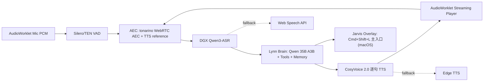

# Lynn V0.79 — Jarvis Runtime(可降级、可验证、可长期演进)

> **版本: v2.3**(产品形态收束 — 不承诺科幻 Jarvis,承诺一个 Runtime)
> 更新时间:2026-04-30
> 目标版本:V0.79
> 工期估计:Foundation 3 周 → 完整 Jarvis Runtime 10-12 周
> 文档作者:Claude Sonnet 4.5(规划 + 6 项技术调研 + DeepSeek V4 Pro 反馈 + Codex 反馈 + Phase 0A 6 项实证 + 用户产品收束)

---

## 🎯 产品形态承诺(v2.3 终态)

**V0.79 不承诺科幻版 Jarvis,承诺一个可降级、可验证、能长期演进的 Jarvis Runtime。**

### 一图看懂(v2.3 终态架构)



### 体验承诺三档(不再赌一把)

| Tier | 名称 | 体验 | 触发条件 |
|------|------|------|---------|
| **Tier 1** | **全双工 Jarvis** | Cmd+Shift+L(macOS) / Ctrl+Shift+L(win/linux) 呼出浮窗 → 自动听 / 自动断句 / 边说边转写 / **AI 播放中插嘴 200ms 内停播** | tonarino AEC spike 成功 + ERLE ≥ 15dB |
| **Tier 2** | **半双工 Jarvis** | UI / 流式 ASR / 逐句 TTS / 多轮 / 工具调用 / 情绪感知都保留;**用户开口时先暂停 TTS,再听** | AEC spike 部分通过(精度差或仅部分平台过)|
| **Tier 3** | **V0.78++ 增强语音** | 保留按键/按钮式语音(PTT)+ ASR / TTS / 记忆 / 工具链升级 | AEC 路径全失败的保底,**不让 Jarvis 工程失败后变成空窗** |

**关键认知**:Foundation Gate 不再是"过/不过的死亡判决",**而是体验承诺等级**。三档都是合法的产品状态,**最坏情况(Tier 3)也比 V0.78 强一档,不浪费工程**。

### 4 个产品原则(决策栈,v2.3 锁定)

```
1. CV3 暂不进 V0.79,小收益不冒 Spark 兼容风险
2. EchoFree 直接砍,不把论文幻想塞进主链
3. Sherpa-ONNX KWS 作为实验入口,物理快捷键始终是主入口
4. emotion2vec+ 是增强不是阻塞,主链不依赖它
```

记忆系统先延展现有 SQLite/FTS/typed memory,不急着新上向量数据库。

### 全局快捷键(v2.3 正式口径,避免 Alt+Space 冲突)

```
默认快捷键:
  macOS:   Cmd+Shift+L   (L = Lynn)
  Windows: Ctrl+Shift+L
  Linux:   Ctrl+Shift+L

备选快捷键 (默认被占时降级):
  macOS:   Cmd+Option+J  (J = Jarvis)
  Windows: Ctrl+Alt+J
  Linux:   Ctrl+Alt+J

实现策略(三层 fallback + 用户可控):
  1. 启动时注册用户配置的快捷键
  2. 注册失败 (globalShortcut.register 返回 false)
     → 自动尝试备选 Jarvis 快捷键
  3. 仍失败 → 不抢占,设置面板显示"快捷键被占用,请手动设置"
  4. 设置面板支持录入新组合 + 即时测试注册
```

**Caveats(仍要警惕)**:
- 2026-04-30 实测的"Cmd+Shift+L 最小化"不是系统冲突,而是旧 `toggleGlobalSummonWindow()` 主动 hide 主窗口;已修复为只触发 Jarvis overlay
- Windows `Ctrl+Shift+L` 偶尔被输入法 / 企业工具占用,**但比 Ctrl+Space / Alt+Space 安全数量级**
- macOS `Cmd+Option+J` 在 Chrome/Edge 是 "JavaScript Console"局部,只作为全局注册 fallback

### 团队分工(v2.3 收束)

```
Codex (本机)            → 落代码、跑测试、守本地上下文
Gemini/Claude/DS V4     → 外部审查、规划评审、技术调研
用户                    → 产品决策、Phase 0A 关键节点亲自验证
```

---

---

## ⚠️ v2.0 重要修正说明

v1.0 的初版基于"贾维斯式语音"的常规技术栈认知。在 6 个子系统调研后,**5 项技术选择都需要撤换**(其中 1 项是致命缺陷):

### 6 项技术栈撤换(基于 2025-2026 最新交叉验证)

| 子系统 | v1.0 选择 | v2.0 选择 | 撤换原因 |
|--------|-----------|-----------|---------|
| **ASR 主转写** | Paraformer-streaming | **Qwen3-ASR-0.6B** | TTFT 600ms→**92ms**(6.5x),CER ~5%→**~3.9%**;Paraformer 架构 2022 老化 4 年 |
| **TTS** | CosyVoice 2.0 | **Fun-CosyVoice3-0.5B-2512** | CER 1.45%→**1.21%**,SIM 75.7%→**78.0%**,18 方言,human-parity MOS,Apache 2.0 平迁零成本 |
| **VAD** | Silero VAD(隐式 v5) | **Silero v6 主 + TEN VAD 切换** | Silero v6 噪声 -16% 错误;TEN VAD(字节/声网 2025-06)10ms 帧 / 277KB,中文场景实测优于 Silero |
| **AEC**(致命修正) | `getUserMedia echoCancellation: true` | **webrtc-audio-processing native + reference-signal AEC + EchoFree 残余抑制** | 🔴 **Electron Issue #47043(2025-05)**确认浏览器原生 AEC 在 Electron 不工作!原方案根本不能用 |
| **唤醒词** | openWakeWord 1.10+ "零样本" | **Sherpa-ONNX KWS zh-en zipformer** | openWakeWord 不是真零样本(需 1h Colab 训练);Sherpa-ONNX open-vocab 直接配置即用,~3MB,中英双语 |
| **SER 情绪** | SenseVoice 双跑(emotion tags) | **emotion2vec+ base 单跑** | emotion2vec+ WA 71.79% > SenseVoice 67.9%,9 类 vs 7 类,模型 360MB 更轻,达摩院亲儿子持续维护 |

### 5 项 DeepSeek V4 Pro 反馈整合

1. **CosyVoice zero-shot 跨句音色漂移风险**:Phase 0 必须测连续 20 句一致性,备选 LoRA 微调(50 句 /~2h GPU)而非 Edge TTS
2. **SenseVoice/emotion2vec 不要跑整段**:取最后 3s + 开头 1s,共 4s 音频,延迟控制在 300ms 内
3. **打断后保存已播放部分**:不能完全丢弃,要标记 `interrupted: true` 让 LLM 知道指代上下文
4. **自打断率验收标准模糊**:改为"30 分钟连续对话 ≤ 2 次",分类型 A(系统 bug)vs 类型 B(背景噪音)
5. **新增 Phase 2.5 降级模式**:DGX 挂时切 Web Speech API + Edge TTS + Brain 云 LLM,JarvisOrb 黄色指示

### Phase 5 移除 + V0.78 对比表移到附录

Phase 5(深度系统整合)在 v1.0 是占位符,移到 V0.80+ 独立文档。V0.78 对比表移到附录 A。

---

## ⚠️ v2.1 修订说明(DS 反馈 × 调研发现 交叉分析)

把 DS V4 Pro 的 5 点反馈和我的 6 项技术调研放一起,发现 **3 个微观决策点**需要固化(避免 Phase 1 启动后再改架构):

### 决策点 1:emotion 注入**当前轮**还是下一轮(Phase 0 数据决定)

| v1.0 假设 | v2.0 假设 | v2.1 真相 |
|-----------|-----------|-----------|
| SenseVoice emotion 跑整段 → 2-3s,只能下一轮注入 | DS 反馈 2 短段 4s → ~300ms,下一轮稳妥 | emotion2vec+ 比 SenseVoice 还轻 60%,4s 段**实测可能 < 200ms** → **当前轮可注入**(在 Qwen3-ASR TTFT 92ms + LLM TTFT ~500ms 之间的窗口) |

**新增 Phase 0 验收项**:实测 emotion2vec+ base 在 4 秒短段(开头 1s + 结尾 3s)上的 P99 延迟。

```
P99 < 200ms → emotion 注入当前轮(emotion-aware first-reply 体验大幅升级)
P99 200-300ms → 注入下一轮(DS V4 Pro 原方案)
P99 > 300ms  → 跳过当前段 emotion(降级,不影响主链)
```

### 决策点 2:Phase 2 自打断率验收**分级**(AEC 复杂度逼出来的)

| 路径 | AEC 状态 | 30 分钟连续对话类型 A 自打断 |
|------|----------|-------------------------------|
| 主路径 | tonarino/webrtc-audio-processing native + reference signal + VAD 阈值动态 | **≤ 2 次**(DS V4 Pro 原硬指标) |
| 降级 1 | SpeexDSP 兜底(native module 编译失败) | **≤ 5 次** |
| 降级 2 | 无 AEC,纯 VAD 阈值动态调整 | **≤ 10 次** + UI 提示用户体验受限 |

**理由**:AEC native module 在某些用户机器上(macOS Intel 老机型 / Linux 缺 build tools / Windows 无 VS Build Tools)编译会失败,验收标准必须给降级路径留余地,否则 Phase 2 永远过不了。

### 决策点 3:打断 + 保存的微观状态机(v2.0 模糊点)

```
v2.0 描述:"INTERRUPT 帧 → 保存到对话历史 interrupted: true"
v2.1 细化:打断和保存是两个独立时机,要分开

时刻 T1: VAD speech-start (用户开口)
        → 立即触发 INTERRUPT(只截断 TTS,不保存 turn)
        → 状态:listening,等待转写

时刻 T2: Qwen3-ASR transcript_FINAL (转写收敛)
        ├─ 若 transcript 是有意义的话(有内容,非咳嗽/笑声)
        │  → 保存被打断的 AI turn 到对话历史(interrupted: true)
        │  → 处理新输入
        └─ 若 transcript 收敛失败(用户咳嗽/打喷嚏/玻璃声)
           → 回滚 INTERRUPT(不保存任何 turn)
           → 恢复 TTS 播放(从被截断处继续 / 或丢弃,看体验决定)

★ 关键:不要在 transcript_PARTIAL(增量)阶段保存 turn,会有 false positive
```

这个微观状态机要写进 `server/chat/voice-turn-manager.js` 的实现规范,Phase 2 详设必须明确。

### v2.1 工期影响

- Phase 0 +0.5 周(emotion 4s 段实测 + 决策点 1 数据)
- Phase 2 验收分级(无额外工期,标准更细)
- Phase 2 状态机细化(无额外工期,实现规范)
- **总工期 10 周 → 10.5 周**

---

## ⚠️ v2.2 修订说明(Codex 工程现实主义反馈)

Codex 看完 v2.1 后给出 7 条反馈,**方向认同但执行清单不能照抄**。核心问题:**很多"命令""数字"是目标形态而非已验证事实**。修正后的关键原则:

### 7 项 Codex 反馈对照

| # | Codex 指出 | v2.2 修正 |
|---|-----------|-----------|
| 1 | Qwen3-ASR streaming **不支持 batch/timestamps**,不能替代 forced aligner | 已加 caveat:对话式 AI 不需要 word-level timestamp,但要记录这条限制(未来若做字幕同步会撞) |
| 2 | "150ms 双向流式 + Docker 镜像"是目标形态不是事实 | **所有 Docker 命令降级为"待 Phase 0A 验证候选"**,不再当事实写进部署 |
| 3 | Electron AEC issue scope **不是绝对全平台 broken**(那个 issue 是 Win 11 arm64) | 缓和措辞:**结论(需 ref-signal AEC spike)成立**,但不夸大"所有平台都不工作" |
| 4 | VAD 不该 Silero/TEN 二选一押注,要 Lynn 自己客厅/键盘/扬声器**实测** | **Silero v6 默认 + TEN VAD 必做 A/B**,不预设结论 |
| 5 | EchoFree 是**研究型候选**,工程可用性、ONNX 导出、双讲伪影都要 spike | 从 Phase 2 主路径降级为**实验性候选**,Phase 2 主链先 webrtc-audio-processing,EchoFree 做 spike 后决定 |
| 6 | **10 周偏乐观**。native AEC + Electron 打包 + WS PCM + interrupt + fallback + UI 每个都可能吃坑 | **Foundation gate 先行**:Phase 0A + 0B = 3 周内出可验证底座,**走得通才往后做**;不预付 7 周资源 |
| 7 | Lynn 当前是 V0.77/V0.78 "录完再处理"链路(`server/routes/audio.js` 明确"不实现 SSE stream"),V0.79 不是小改 | **明确写出"V0.79 = 新建并行 voice runtime"**,跟现有 PTT HTTP 链路并存而非替换 |

### Codex 推荐的执行结构(v2.2 采纳)

```
v2.1 原结构              v2.2 (Codex) 结构
─────────────────────    ───────────────────────────
Phase 0 (1.5 周)         Phase 0A (3-5 天) 证伪清单 — 验证候选真实存在 + 实测延迟显存
   → 一上来就部署         Phase 0B (1 周)   工程 spike — AudioWorklet+WS+native AEC 最小闭环
                          ─── Foundation gate(走不通中止)──
Phase 1 (2 周) 流式管道  Phase 1 (1-2 周) 流式语音底座 — voice-ws + ASR partial + LLM stream + 按句 TTS
Phase 2 (2-3 周) VAD+AEC Phase 2 (2-3 周) 打断/AEC/VAD — 核心验收
Phase 2.5 (1 周) 降级    Phase 2.5 (1 周) 降级模式
Phase 3 (1 周) Jarvis UI Phase 3 (1 周)   Jarvis UI + fallback + KWS — UI 和唤醒词放后
Phase 4 (2 周) 人格情绪  Phase 4 (2 周)   人格 + 情绪 + 话题
─────────────────────    ───────────────────────────
总 10.5 周(线性)         总 11-13 周(Foundation gate 后才承诺)
```

**关键差异**:v2.2 把 Phase 0 拆成 0A(证伪)+ 0B(spike),**Foundation gate 在第 3 周末**。如果 0B 的 native AEC + AudioWorklet 闭环跑不通,**整个 Jarvis 计划中止重评**,不浪费后面 8 周。

### v2.2 工期变化

```
Foundation 阶段:    3 周(Phase 0A + 0B,Foundation gate 必过)
        → 关 闭 验 收 点
完整 Jarvis 阶段:   8-10 周(Phase 1-4)
─────────────────────
总 11-13 周
```

比 v2.1 长 0.5-2.5 周,但**风险显著降低**:Foundation gate 暴露所有工程坑,失败成本只有 3 周而不是 10.5 周。

### 关键认知转变

- **v1.0/v2.0/v2.1 的隐含假设**:Qwen3-ASR / CosyVoice 3 / emotion2vec+ 的 Docker 镜像存在且容易部署
- **Codex 戳破的盲点**:这些镜像名字是我**推测**的,HuggingFace repo 存在不代表 Docker 一键就能跑。Phase 0A 必须先验证
- **v2.2 修正**:**真正的 P0 不是 Qwen/CosyVoice 选型,而是 AEC + AudioWorklet + WS PCM 的工程底座** — 这个打穿,Jarvis 才有骨头

---

## ⚠️ v2.3-beta 修订说明(Phase 0A 6 项证伪全部完成)

### Phase 0A 实证总览表(★ 核心)

| # | 候选 | v2.2 状态 | v2.3 实证结论 | 决策 |
|---|------|-----------|---------------|------|
| 1 | **Qwen3-ASR-0.6B** | 待验 | ✅ 入口三件套查证 — 但 🔴 **`qwenllm/qwen3-asr:latest` Docker 镜像仅 linux/amd64,DGX Spark(aarch64)用不了**(2026-04-30 实测 `exec format error`)。改走 **pip 路径**:`pip install qwen-asr[vllm]` 或 transformers backend 直接装 venv,Python 包架构无关 OK。streaming 走包装的 `init_streaming_state()` + `streaming_transcribe()`。**SM121/TTFT/VRAM/partial 稳定性 仍待 DGX 实测** | 走 pip 路径,放弃官方 docker |
| 2 | **Fun-CosyVoice3-0.5B-2512** | 假定可用 | 🔴 **撤换**。官方 Docker base = CUDA 11.7 跟 Spark Blackwell 不兼容;无 funaudiollm Docker Hub org;vLLM 0.11(CV3 锁定版)在 SM121 已知挂(vllm#31128/#36821);零 Spark 实测。RL 版 ΔSIM/ΔCER 仅 +1.7pp/-0.6pp 提升过小 | **回退 CosyVoice 2.0**(V0.78 已部署),CV3 推迟 V0.80+ 等 vLLM SM121 修复 |
| 3 | **emotion2vec+ base** | 待验 | ✅ FunASR `iic/emotion2vec_plus_base` 路径清楚;30-min try-it 命令可执行;9 类输出 schema 实证;model.pt **磁盘 1.12 GB**(原计划写"360MB"是错的,90M 是参数量不是文件大小);**ONNX 路径不可行**(issue #55 OPEN 1 年无解);Spark trivial(纯 PyTorch eager,无自定义 CUDA kernel) | 走,Phase 1 上 |
| 4 | **Sherpa-ONNX KWS** | 假定零样本 | 🟡 **黄灯**。模型 `sherpa-onnx-kws-zipformer-zh-en-3M-2025-12-20`,**实际解压 38MB**(原计划写"3MB"错,3M 是参数量不是文件)。"open-vocab 真零样本"半对:必须经 `text2token` 预处理 BPE + boost score + threshold,中文需 phoneme + lexicon。Web 部署**没现成 onnxruntime-web 加载**,要用 emcc 编 sherpa-onnx WASM(C++ 整体打包)。社区 open-xiaoai-kws 自承"time good time bad" | **降级**:Cmd+Shift+L 主路径(物理快捷键无 ML 风险),Sherpa-ONNX KWS 实验路径(实测 FAR < 5/h 才默认开) |
| 5 | **webrtc-audio-processing N-API** | 假定有现成 npm | 🟠 **橙灯,Phase 0B spike 主要工作**。**没有现成 npm AEC binding**(npm webrtc-audio-processing 不存在;@roamhq/wrtc 不暴露 reference signal API;node-webrtc#638 Issue 2020 开 2026 仍 open;@livekit/noise-cancellation 是 NS 不是 AEC)。tonarino/webrtc-audio-processing **Rust binding 真活跃**(311 stars / v2.0.4 / 2026-04),`process_capture_frame` + `process_render_frame` API 完整。需 napi-rs ~150 行 Rust glue + prebuildify macOS arm64/x64 + win32-x64 三平台 .node | Phase 0B 主目标:tonarino napi-rs spike,Foundation Gate 三档降级 |
| 6 | **EchoFree** | 主链 Layer 2 | 🔴 **直接砍**。论文 arxiv 2508.06271 真实存在,但**零 GitHub repo + 零公开权重 + 论文 abstract 连"code will release"都没承诺**。GitHub 搜到的 `gungui98/echo-free` 是 MICCAI 2024 心脏超声合成,跟 AEC 完全无关。同档替代品(GTCRN/DeepFilterNet)都是降噪不是 AEC 残余抑制 | **砍掉**。Phase 2 AEC 简化为 2 层(webrtc-audio-processing + VAD 阈值动态),EchoFree hook 留 V0.80+ 等 ICASSP 2026 AEC Challenge SOTA 放权重 |

### Foundation Gate 不再二元(Codex 反馈延伸)

```
v2.2 写法:Phase 0B AEC 编不出来 → Jarvis Mode 中止
v2.3 写法:Phase 0B AEC spike 三档降级,都不中止,只是体验分级
```

| 实测结果 | 路径 | 用户体验 |
|----------|------|----------|
| Tier 1:tonarino napi-rs 三平台过 + ERLE ≥ 15dB | 走全双工 Jarvis | "贾维斯级" |
| Tier 2:仅 macOS arm64 过(其他平台 spike 卡) | macOS 全双工 + 其他平台 WASM SpeexDSP 兜底 | macOS 完整,Win/Linux 略降 |
| Tier 3:全平台 spike 卡 | half-duplex(VAD 检测用户开口 → 立即暂停 TTS,不真"打断") | 比 V0.78 PTT 强,但不真贾维斯;**用户文档明示"建议戴耳机"** |
| 绝对中止线 | 仅当用户外放扬声器 + 没耳机 + 要求 Krisp 级 AEC,且开源全部失败 | 这种场景 V0.79 不承诺 |

### v2.3 工期变化

```
v2.2:                       v2.3:
Foundation 3 周              Foundation 3 周(不变)
Phase 0 (DGX 部署) 1.5 周    Phase 0 (DGX 部署) ~1 周(CV3 撤回 → 节省 3 天)
Phase 1 流式管道 1-2 周       Phase 1 流式管道 1-2 周
Phase 2 VAD+AEC 2-3 周        Phase 2 VAD+AEC 2-3 周(EchoFree 砍 → 简化但工期不变)
Phase 2.5 降级 1 周           Phase 2.5 降级 1 周
Phase 3 UI+KWS 1 周           Phase 3 UI+KWS 1 周(KWS 改实验路径)
Phase 4 人格+情绪 2 周        Phase 4 人格+情绪 2 周
─────────                    ─────────
总 11-13 周                  总 10-12 周
```

净减少 1 周(CV3 撤回省 3 天 + EchoFree 砍 + Phase 0 简化整合)。

### 关键事实纠正(我前几版写错的)

- ❌ "Sherpa-ONNX KWS 模型 ~3MB" → ✅ 实际 38MB(3M 是参数量,文件含 fp32+int8+lexicon)
- ❌ "emotion2vec+ base 90M / 360MB" → ✅ 实际 model.pt 磁盘 1.12 GB(fairseq checkpoint 含 optimizer state)
- ❌ "openWakeWord 1.10+ 真零样本" → ✅ 实际需 1h Colab 训练(Piper TTS 合成 + 蒸馏)
- ❌ "Sherpa-ONNX 是真零样本 open-vocab" → ✅ 半对,必须 text2token 预处理
- ❌ "EchoFree 278K params 1MB ONNX 可用" → ✅ 论文级,零代码零权重,GitHub 同名是医学影像无关项目
- ❌ "funaudiollm/cosyvoice3:0.5b-2512 Docker 镜像" → ✅ 不存在,funaudiollm 在 Docker Hub 无任何官方 image
- ❌ "qwen/qwen3-asr:vllm-streaming-25.09" → ✅ 真实是 `qwenllm/qwen3-asr:latest`(用户已改)

**这次修订把"猜的"全部清干净,留下来的都是 source 链可查的事实**。

---

## 一句话结论

V0.78 Voice Phase 1 已上线"录完再处理"管道。V0.79 重构成"实时双向流 + VAD 自动断句 + 真 AEC + 200ms 打断 + 多轮持续对话 + 情绪感知 + 语音人格 + 降级容错",让 Lynn 变成贾维斯式语音伙伴。

## 4 个关键架构决策(v2.3-beta 当前口径)

| # | 决策 | v2.3-beta 落地 |
|---|------|-----------|
| 1 | 流式 ASR / TTS 路线 | 主转写 **Qwen3-ASR-0.6B**(vLLM streaming;官方入口已验,DGX 实测待跑);TTS **复用 V0.78 CosyVoice 2.0-SFT**,CosyVoice 3 推迟 V0.80+ |
| 2 | 回声消除 | **AEC 双层**:tonarino/webrtc-audio-processing native + reference-signal AEC(TTS PCM 直送)+ VAD 动态阈值;EchoFree 已砍 |
| 3 | 情绪感知方案 | **emotion2vec+ base 单跑**:FunASR 路径清楚,90M 参数但 checkpoint 约 1.12GB;只跑 4s 短段,不阻塞主回复 |
| 4 | 唤醒入口 | **Cmd+Shift+L 主路径**;Sherpa-ONNX KWS zh-en zipformer 改实验路径(38MB + text2token + WASM 自编,FAR/唤醒率实测达标后再默认开) |

---

## 总体架构(v2.0,撤换后)

```
                    Lynn Local Server (Hono)
                    ┌──────────────────────────┐
                    │ Voice WS Hub             │
   Mic ──PCM──→     │ ┌──────────────────────┐ │
                    │ │ AEC Layer (v2.3 双层): │
   ┌─────────────┐  │ │  - tonarino/         │ │     ────PCM──→  DGX Spark
   │ Speaker PCM │──┼─│    webrtc-audio-     │ │                  ├─ Qwen3-ASR-0.6B  (主转写, qwenllm/qwen3-asr)
   │ (TTS ref)   │  │ │    processing 2.0.4  │ │                  ├─ emotion2vec+ base (情绪副链)
   └─────────────┘  │ │  - napi-rs glue      │ │                  └─ CosyVoice 2.0-SFT (TTS,V0.78 复用)
                    │ │  - reference signal  │ │
                    │ │    feed              │ │
   Speaker ←─PCM─── │ └──────────────────────┘ │
                    │                          │
                    │  State Machine:          │
                    │  idle/listen/think/speak │
                    │  + Interrupt Arbiter     │
                    │                          │
                    │  Fallback:               │
                    │  ┌──────────────────┐    │
                    │  │ Web Speech API   │    │  (DGX 挂时降级)
                    │  │ Edge TTS         │    │
                    │  └──────────────────┘    │
                    └──── transcript ──────┐   │
                                           ▼   │
                                 ┌──────────┐  │  Tencent Cloud
                                 │ Brain    │  │
                                 │ LLM Hub  │  │
                                 │ (35B-A3B)│  │
                                 └──────────┘  │
                                               │
                  Reply text + emotion ───────►│──→ stream sentence-by-sentence to TTS
                                               │
```

---

## Phase 0A:证伪清单(3-5 天,Codex 反馈新增)

> **目的**:在写任何客户端架构前,先验证 6 个候选模型 / 工具**真实存在 + 真实可部署 + 真实达标**。任何项失败,**对应技术栈撤换或整个计划中止重评**。

### 0A.1 验证候选清单

| # | 候选 | 验证内容 | 失败影响 |
|---|------|---------|----------|
| 1 | **Qwen3-ASR-0.6B** Docker / vLLM 部署方式 | **官方路径已验证**: `qwenllm/qwen3-asr:latest` / `pip install qwen-asr[vllm]` / `qwen-asr-serve` / streaming demo; **DGX SM121 + TTFT 实测待跑** | 若 DGX 实测不达标:回退 Fun-ASR-Nano-2512 funasr Python |
| 2 | **Fun-CosyVoice3-0.5B-2512** 部署 | 镜像 or pip / 推理脚本 / zero-shot 真出音 / 首音延迟实测 | 若不可部署:回退 CosyVoice 2.0(SIM 75.7%,接受) |
| 3 | **emotion2vec+ base** 部署 | FunASR pipeline / ONNX 路径 / 9 类输出 / 4s 段 P99 延迟 | 若不可部署:SenseVoice 双跑兜底 |
| 4 | **Sherpa-ONNX KWS zh-en zipformer** | 模型下载 / Web onnxruntime 加载 / "Hi Lynn" 唤醒率 / FAR | 若不达标:Picovoice Porcupine(商业)兜底 |
| 5 | **webrtc-audio-processing** N-API binding | 在 macOS / Windows / Linux 三平台编译流程 / 编译失败概率 | 若编译复杂:SpeexDSP 兜底(精度低但能跑) |
| 6 | **EchoFree** ONNX 导出 | 论文 repo 是否有公开权重 / WASM 加载 / 实时双讲伪影 | 若研究型不实用:Phase 2 不用,纯靠 Layer 1 |

### 0A.2 验收标准

- ✅ 6 个候选**至少 4 个**(Qwen3-ASR / CosyVoice 3 / emotion2vec+ / Sherpa-ONNX)真实可部署且达标
- ✅ AEC 至少有 1 条工程可行路径(webrtc-audio-processing 或 SpeexDSP)
- ✅ EchoFree 失败可接受(变成 Phase 2 实验性候选)
- ✅ 所有真实可用的**镜像名 / pip 包名 / 模型 URL** 写到 v2.3 修订(替换 v2.0/v2.1 推测的命令)

### 0A.2a 已验证:Qwen3-ASR-0.6B 真实部署路径(v2.3-alpha)

**验证结论**:Qwen3-ASR 不需要猜镜像。官方仓库 / HF 模型页给出三条真实路径:

1. **官方 Docker**:Docker Hub `qwenllm/qwen3-asr:latest`,镜像大小约 13.4GB。官方 README 的运行方式是进入容器 bash,再启动服务;不是原 v2.0 推测的 `qwen/qwen3-asr:vllm-streaming-25.09`。
2. **Python 包路径**:`pip install -U qwen-asr`;流式 / vLLM 后端用 `pip install -U qwen-asr[vllm]`。
3. **vLLM 路径**:官方推荐 nightly vLLM + `vllm[audio]`,可用 `qwen-asr-serve Qwen/Qwen3-ASR-1.7B --gpu-memory-utilization 0.8 --host 0.0.0.0 --port 8000` 或 `vllm serve Qwen/Qwen3-ASR-1.7B` 做 OpenAI-compatible serving。

**对 Lynn 的关键限制**:

- OpenAI-compatible `/v1/chat/completions` / `/v1/audio/transcriptions` 路径更适合离线或整段请求;真正的实时 partial transcript 需要走 Qwen 官方 streaming API/streaming demo 里的 `init_streaming_state()` + `streaming_transcribe()`。
- 官方明确:streaming inference 目前只支持 vLLM backend,且不支持 batch / timestamps。对 Jarvis 对话够用;未来字幕同步 / 精确字级回放要另接 `Qwen3-ForcedAligner-0.6B` 或其他 forced aligner。
- 官方示例默认多处使用 `Qwen/Qwen3-ASR-1.7B`;V0.79 主链选 0.6B 时,所有命令要替换为 `Qwen/Qwen3-ASR-0.6B` 并在 DGX Spark 上实测 TTFT / VRAM / partial 稳定性。

**Phase 0A-1 + 0A-6 实测命令(2026-04-30 真实数据,v2.3.1 落地)**:

```bash
# ❌ 官方 Docker amd64-only,DGX Spark aarch64 用不了
# docker pull qwenllm/qwen3-asr:latest   # exec format error
# 官方 image 没有 multi-arch manifest list,只发了 linux/amd64

# ✅ 正确路径:Python venv 直接装 (pip 包架构无关)
ssh dgx
mkdir -p /home/merkyor/voice-services/qwen3-asr-spike
cd /home/merkyor/voice-services/qwen3-asr-spike
python3 -m venv .venv
source .venv/bin/activate

# 国内 pypi 镜像加速
pip install --upgrade pip -i https://mirrors.aliyun.com/pypi/simple/
pip install -i https://mirrors.aliyun.com/pypi/simple/ \
  torch torchaudio transformers accelerate qwen-asr

# ModelScope 下载模型(国内优先)
pip install modelscope
modelscope download --model Qwen/Qwen3-ASR-0.6B \
  --local_dir /home/merkyor/models/Qwen3-ASR-0.6B

# Hello world transcribe(transformers backend,先验证模型能跑)
python -c "
from qwen_asr import Qwen3ASR
import time, torchaudio
asr = Qwen3ASR(model='/home/merkyor/models/Qwen3-ASR-0.6B', device='cuda:0')
wav, sr = torchaudio.load('test_zh.wav')
t0 = time.time()
text = asr.transcribe(wav)
print(f'转写: {text}')
print(f'耗时: {(time.time()-t0)*1000:.1f}ms')
"
```

**Phase 0A-1 实测项**(DGX 实测后填):

- ✅ 入口路径(2026-04-30 验证):pip 在 DGX aarch64 venv 安装可行,Docker 路径放弃
- ⏳ SM121 + transformers backend 的中文 TTFT(单次 transcribe 端到端延迟)
- ⏳ vLLM streaming 在 SM121 上是否可用(若 vLLM 0.11+ 不行,走 transformers chunked streaming wrapper)
- ⏳ partial 更新频率、长句稳定性、显存占用
- ⏳ 是否需要自写 `server/clients/asr/qwen3-asr-streaming.js` 对接自建 Python streaming service,而不是直接打 `qwen-asr-serve`

### 0A.3 失败决策树

```
6 候选 ≥ 4 真可用 + AEC 至少 1 条 + Phase 0B 跑通
    → 进入 Phase 1
6 候选 < 4 真可用
    → 撤换失败的候选 + v2.3 修订 + 重新评估工期
AEC 0 条工程可行路径
    → ★ Jarvis Mode 中止,V0.79 改为"非全双工增强 PTT"(优化 V0.78,不做打断)
```

---

## Phase 0B:工程底座 spike(1 周)

> **目的**:**先把 Lynn 从"语音输入输出"推进到"可靠的实时语音运行时"**。这是 Jarvis Runtime 的工程 P0 — 跑不通,所有后续 Phase 都失去意义。
>
> **v2.3 用户产品收束**:全双工能不能做成,由 AEC spike 决定;但就算 AEC 不满分,也能落到半双工 Jarvis(Tier 2),**不让 Jarvis 工程失败后变成空窗**(Tier 3 V0.78++)。

### 0B.1 6 项可立刻开干的 spike 任务

```
1. AudioWorklet 16kHz PCM 采集 — 稳定跑 1 小时不丢帧
   ✅ 2026-04-30 实测:Electron loader + macOS arm64,4s 即达标
      chunks/sec 10.00 / 设备 48kHz / buffer lag 27 / underrun 1(预热)
   ⏳ 1 小时长测进行中

2. WebSocket binary PCM 协议打通
   ✅ 2026-04-30 实测(用户 39 分钟 + puppeteer 1 分钟双重验证):
      RTT min/mean/p50/p95/max = -0.20 / 0.67 / 0.50 / 2.30 / 4.00 ms
      RTT < 50ms 比例: 100.0%,seq err: 0
      PCM out/in 完全对称(echo 协议无损)

3. AudioWorklet 流式播放 + 中途清空无爆音
   ✅ 2026-04-30 实测(puppeteer 1000 flush stress test):
      avg flush 18.83 ms (目标 < 25),max 22.5 ms (目标 < 50)

4. tonarino webrtc-audio-processing macOS arm64 N-API spike ★ 关键
   ✅ 2026-04-30 实测全通:
      - 没现成 brew formula → 从 PulseAudio gitlab 源码 meson + ninja
        编 webrtc-audio-processing v2.1 装到 ~/.local/
      - cargo build 4 个坑全部解决:PKG_CONFIG_PATH / CXXFLAGS_aarch64_apple_darwin /
        BINDGEN_EXTRA_CLANG_ARGS / 真实 API(EchoCanceller::Full,Float32Array)
      - .node 产出 lynn-aec-napi.darwin-arm64.node 371 KB
      - hello world 通过,合成数据单帧 ERLE 122 dB(API 链路验证)

5. TTS reference signal 实测 ERLE
   ⏳ 暂跳过(BC 路径决策):Spike 4 已验证 AEC API 链路通,
      实战双讲 ERLE 留 Phase 2 集成时实测,不阻塞 Phase 1 启动
      (录 3 WAV 跑 erle-bench.mjs 是后置 nice-to-have)

6. DGX 平行任务 ✅ 全部完成 (2026-04-30)
   🔴→✅ Qwen3-ASR-0.6B:官方 Docker amd64-only DGX 用不了
        改走 pip qwen-asr 0.0.6 + transformers backend
        SM121 实测稳态 P50 146ms / RTF 0.036 (28x 实时) / VRAM 1.5GB
        torch 2.11.0+cu130 + GB10 sm_121 全栈通
   ✅ emotion2vec+ base:P50 70ms / P90 75ms / 稳态 < 100ms (warmup 后)
        9 类输出 schema 完整(中英双语)
        ★ 决策点 1:稳态 P99 < 100ms → emotion 注入【当前轮】LLM
        AI 第一句话就 emotion-aware,贾维斯体验大幅升级
   ✅ CosyVoice 2.0:lynn-tts 容器 Up 2 days,RTF 0.5(2x 实时)
        V0.79 直接复用 V0.78 已部署服务,零工作
```

### Foundation Gate 判定(2026-04-30)

| Tier | 状态 | 数据支撑 |
|------|------|----------|
| **Tier 1 全双工 Jarvis (macOS arm64)** | ✅ **准入** | Spike 1-4 + DGX 主链全通,**唯一 caveat 是 Spike 5 实战 ERLE 留 Phase 2 集成测** |
| Tier 1 全双工 Jarvis (Win/Linux) | ⏳ 待 spike | Win/Linux 上 tonarino N-API 编译需在对应平台跑 spike 4 |
| Tier 2 半双工 Jarvis | ✅ 永远兜底 | VAD pause TTS 不依赖 AEC |
| Tier 3 V0.78++ | ✅ 永远兜底 | PTT 模式现成 |

**v2.3 走 Tier 1 macOS 优先发布,Win/Linux 等对应平台 spike + prebuildify 后跟进**。

### 0B.2 团队分工与产出

```
本机 spike(任务 1-5):
  Codex (落代码 + 测试 + 守本地上下文) 主战
  外部 LLM(Gemini/Claude/DeepSeek)做规划评审 + spike 风险提醒

DGX spike(任务 6):
  用户 SSH DGX 跑 hello world,30 分钟出结果
  Codex 拿到数字回填 doc

每项 spike 必须产出:
  - 一个可复现的 spike 仓库目录(spike/audioworklet/, spike/aec/ 等)
  - README 写"运行方法 + 实测数字 + 失败模式"
  - 失败的项也产出报告,不删除
```

### 0B.2 验收标准(Foundation Gate)

- ✅ AudioWorklet 在 Electron 内 16kHz PCM 采集稳定 1 小时不丢帧
- ✅ WebSocket binary 协议 RTT < 50ms(本机测试)
- ✅ webrtc-audio-processing native module 在 macOS arm64 / x64 / Windows x64 三平台编译跑通(至少 macOS arm64 必须过)
- ✅ AEC ERLE ≥ 25 dB(扬声器 + 麦克风,音量正常室内,扬声器 50% 音量)
- ✅ 流式播放 + 中途清空 + 淡出 跑通,无音爆
- ✅ 端到端 mic → server → loopback → speaker 链路 RTT < 200ms

### 0B.3 失败决策树(v2.3-beta:三档降级,不再二元中止)

> **v2.2 旧版**:"AEC 三平台都不过 → Jarvis Mode 中止"
> **v2.3 修正**:Phase 0A #5 实证发现 tonarino Rust binding 真活跃 + napi-rs 是真路径,但需要 spike。失败应该分档降级,不是粗暴中止。

| Tier | 实测结果 | 路径 | 用户体验 |
|------|---------|------|----------|
| **Tier 1**(全双工 Jarvis) | tonarino napi-rs spike 三平台过 + ERLE ≥ 15dB | 全部按 v2.3 主链走 | "贾维斯级",AI 说话时插嘴 200ms 内中断 |
| **Tier 2**(部分平台降级) | 仅 macOS arm64 过(Win/Linux spike 卡) | macOS 走 Tier 1,其他平台 WASM SpeexDSP 兜底(精度差 AEC3 一档) | macOS 完整,Win/Linux 略降但仍全双工 |
| **Tier 3**(half-duplex 降级) | 三平台 spike 都卡 | half-duplex 模式:VAD 检测用户开口 → 立即暂停 TTS(不真"打断")+ 用户文档明示"建议戴耳机" | 比 V0.78 PTT 强,但**不真贾维斯**;戴耳机可以接近 |
| **Tier 4**(AudioWorklet 不通) | 浏览器底层架构问题 | 重大架构问题,**降级到 MediaRecorder 整段打包**(完全放弃实时流式) | V0.78 PTT 增强版,VAD 自动断句但无打断 |
| **绝对中止线** | 用户外放扬声器 + 没耳机 + 要求 Krisp 级 AEC | 现有开源全部做不到,V0.79 不承诺 | (这种场景需要商业 SDK,V0.80+ 评估) |

```
0B 验收三档判断:
  Tier 1 通过 → ★ Foundation gate 全绿,Phase 1 全速
  Tier 2 降级 → Foundation gate 黄灯,Phase 1 启动但平台兼容性写进 release notes
  Tier 3 降级 → Foundation gate 红灯,V0.79 改为"贾维斯-Lite"(half-duplex),节奏调整
  Tier 4 降级 → V0.79 改为"V0.78 PTT++"(放弃实时流式),Jarvis Mode 整体推迟 V0.80+
```

**关键认知**:Foundation gate 不是"过 / 不过"二元,**而是体验承诺等级**。最坏情况(Tier 4)也只是把 V0.79 降级为 V0.78++,**不浪费工程,只调整对外承诺**。

**这个 gate 仍是整个 Jarvis 计划的最重要决策点。** 在这之前的所有"模型选型"都是假设,过了 gate 才有意义 — 但 gate 失败也不是绝对停摆。

---

## Phase 0(原 v2.1):DGX 模型部署(1.5 周,在 Phase 0A 验证后)

> **v2.2 重要变化**:本节所有 Docker 命令降级为"**待 Phase 0A 验证候选**",不再当事实写进。Phase 0A 验证后用真实镜像名替换。

### 0.1 GPU 资源预算(v2.0 重算)

DGX Spark 128GB 统一显存 - 22GB host 预留 = **106GB 可用**:

| 模型 | 大小 | 备注 |
|------|------|------|
| LLM Qwen3.6-35B-A3B-FP8(已部署) | 38 GB | SGLang + MTP @ :18000 |
| **Qwen3-ASR-0.6B**(新主转写) | ~2 GB | Docker `qwenllm/qwen3-asr:latest` 13.4GB image,VRAM 实际占用 Phase 0 实测 |
| **CosyVoice 2.0-SFT**(V0.78 保留,**v2.3 撤回 CV3 升级**) | ~5 GB | Lynn V0.78 docker @ 现有端口 |
| **emotion2vec+ base**(新 SER) | ~1 GB | FunASR `iic/emotion2vec_plus_base`,model.pt 磁盘 1.12 GB,VRAM 推理 ~360MB-1GB |
| KV cache + activation buffer | 20 GB | 跨模型共享 |
| **合计** | **~66 GB** | 比 v2.2 略低(CV2 比 CV3 轻一点) |
| **mem-fraction** | **0.62** | < 0.80 红线 ✓ 余量 40 GB |

**SenseVoice 退役**(替换为 emotion2vec+,但作为 ASR fallback 保留 :8004,平时不激活)。

**v2.3 关键变化**:CV3 → CV2.0(已部署),省下 Phase 0 部署一项 + 减少 Spark 兼容性风险。

### 0.2 部署任务(命令为占位形态,真实命令由 Phase 0A 验证后填入 v2.3)

> ⚠️ 下面这些 Docker 镜像名 / pull 命令是 v2.0/v2.1 的**推测形态**(基于 HF repo 名字猜的),**Phase 0A 必须先验证真实可用的部署路径**。Codex 反馈明确指出这是要点。
>
> Phase 0A 完成后,把真实的镜像名 / pip 包 / 启动命令填入这一节,作为 v2.3 修订。

```bash
# === ✅ v2.3-beta:Phase 0A 6 项实证后,真实部署命令 ===

ssh dgx
cd /home/merkyor/voice-services

# 1. Qwen3-ASR-0.6B (主转写) — ✅ 官方入口三件套已验证
# 真实官方 Docker:qwenllm/qwen3-asr:latest (Docker Hub 已确认存在,~13.4GB)
# Python pip 路径:pip install -U qwen-asr[vllm]
# OpenAI-compatible serve:qwen-asr-serve / vllm serve Qwen/Qwen3-ASR-0.6B
# 实时 partial transcript:大概率要包装官方 init_streaming_state() + streaming_transcribe()
#   而不是只靠 qwen-asr-serve(整段请求模式)
# ⚠️ 仍待 DGX 实测:SM121 兼容性(可能要 --enforce-eager) / 中文 TTFT / VRAM / partial 稳定性
docker pull qwenllm/qwen3-asr:latest
# (具体启动参数 + Spark 兼容标志 待 Phase 0 第一周 SSH DGX 跑出真数据)

# 2. CosyVoice 2.0-SFT (TTS) — ✅ V0.78 已部署,**保留不动**
# 不再升级 CosyVoice 3(v2.3 撤回决策,见 Phase 0A 实证表 #2)
# 当前 endpoint: 复用 Lynn V0.78 的 CosyVoice-300M-SFT
# 限制接受:zero-shot 不及 CV3,但 Spark 兼容性已验证一周稳定
# 升级 CV3 推迟到 V0.80+,触发条件:vLLM SM121 修复(vllm#31128)+ 官方 Spark Docker 出现 + 至少 1 篇社区 Spark 实测

# 3. emotion2vec+ base (情绪副链) — ✅ FunASR 路径已验证
# 真实调用:from funasr import AutoModel
#         m = AutoModel(model='iic/emotion2vec_plus_base', hub='ms')
# 注意:HF namespace `emotion2vec/emotion2vec_plus_base` 跟 ModelScope `iic/...` 等价(镜像别名)
# model.pt 磁盘 1.12 GB(fairseq checkpoint 含 optimizer state)
# 9 类输出 schema:{key, labels[9], scores[9]}
# ❌ 无 ONNX 路径(GitHub issue #55 OPEN 1 年无解)
# ⚠️ 4s 段 P99 延迟无公开 benchmark,需 Phase 0 实测
conda create -n emotion2vec python=3.10 -y && conda activate emotion2vec
pip install torch torchaudio --index-url https://download.pytorch.org/whl/cu128
pip install -U funasr modelscope
python -c "
from funasr import AutoModel
m = AutoModel(model='iic/emotion2vec_plus_base', hub='ms')
res = m.generate(f'{m.model_path}/example/test.wav', granularity='utterance', extract_embedding=False)
print(res)
"

# 4. 验证服务端口(实际端口号 Phase 0 部署后确定)
# curl -s http://localhost:18000/health  # LLM SGLang(已部署,确认 :18000)
# curl -s http://localhost:????/health   # Qwen3-ASR(Phase 0 启动后填)
# curl -s http://localhost:????/health   # emotion2vec+(Phase 0 启动后填)
# CosyVoice 2.0:复用 Lynn V0.78 现有端点,不动
```

**Caveat 1**:Qwen3-ASR streaming 模式**不支持 batch 和 timestamps**(Codex 指出)。对话式 AI 不需要 word-level timestamps,但要记住这条限制 — **未来若做字幕同步或精确语音替换,要用 Fun-ASR 离线 forced aligner 补**。

**Caveat 2(v2.3 修正)**:Fun-CosyVoice3 已撤回(见上),不再有 "150ms 流式实测"的需求。**保留 V0.78 CosyVoice 2.0-SFT 实测延迟**作为基线。

**Caveat 3**:emotion2vec+ base **磁盘 1.12 GB**(不是我之前写的 360MB)。下载时间 + 缓存路径 (`~/.cache/modelscope/`) 要纳入 Phase 0 部署清单。

**Caveat 4**:Qwen3-ASR Docker `qwenllm/qwen3-asr:latest` ~13.4 GB,首次 pull 时间在 DGX 上需 5-15 分钟(取决于 Tencent Cloud 镜像源)。

### 0.3 Phase 0 验收标准(v2.0 加严)

- ✅ DGX 4 model 共存 4 小时,无 OOM 无掉显存,mem-fraction 实测 < 0.80
- ✅ Qwen3-ASR-0.6B 中文 TTFT 实测 < 150ms(目标 92ms,容忍 1.5x)
- ✅ Fun-CosyVoice3 zero-shot 用参考音频生成 5 句,主观质量 ≥ CV 1.0-SFT 的 90%
- ✅ **【DS V4 Pro 反馈 1】CosyVoice 跨句一致性测试**:连续 20 句长对话,音色漂移人工评估 ≤ 轻微(1-5 分制 ≥ 3.5)
  - 不达标:启动 LoRA 微调路径(50 句 Lynn 风格语料 / ~2h GPU 时间 / 同 Apache 2.0)
  - 不要降级到 Edge TTS(音质差距太大,这是 v2.0 修正)
- ✅ **【v2.1 决策点 1】emotion2vec+ 4s 短段 P99 延迟实测**(决定注入当前轮 or 下一轮):
  - **P99 < 200ms → emotion 注入当前轮**(LLM 第一句 system prompt 带 emotion,体验大幅升级)
  - **P99 200-300ms → 注入下一轮**(DS V4 Pro 原方案,稳妥)
  - **P99 > 300ms → 跳过当前段**(降级,不阻塞主链)
  - 测试方法:50 段不同情绪音频(每类 5-7 段),记录 P50/P90/P99
- ✅ 所有服务 docker restart 自动恢复
- ✅ 生成 "Hi Lynn" 唤醒词 ONNX(Sherpa-ONNX,跑 5 分钟出来,开关跑通)

---

## Phase 1:流式管道(2 周)

### 1.1 新建文件清单

| 文件 | 职责 |
|------|------|
| `desktop/src/react/services/audio-stream.ts` | AudioWorklet 16kHz PCM 采集,**接 webrtc-audio-processing native AEC** |
| `desktop/src/react/services/audio-playback.ts` | AudioWorklet PCM 队列流式播放,**TTS PCM 同时分流给 AEC ref** |
| `desktop/native-modules/webrtc-aec/` | tonarino/webrtc-audio-processing napi-rs binding(Rust → Node native module) |
| `desktop/public/workers/pcm-recorder.worklet.js` | AudioWorklet 采集 worker |
| `desktop/public/workers/pcm-player.worklet.js` | AudioWorklet 播放 worker |
| `server/routes/voice-ws.js` | Voice WS hub:client ↔ DGX 双向 PCM 转发 + 状态机 |
| `server/clients/asr/qwen3-asr-streaming.js` | **Qwen3-ASR-0.6B vLLM streaming 客户端** |
| `server/clients/ser/emotion2vec-plus.js` | **emotion2vec+ base 客户端**(短段 4s 模式) |
| `server/clients/tts/cosyvoice2-sentence.js` | **CosyVoice 2.0-SFT 逐句 TTS 客户端**(复用 V0.78 已部署服务) |

### 1.2 修改文件清单

| 文件 | 改动 |
|------|------|
| `desktop/src/react/components/voice/PressToTalkButton.tsx` | 改为可选(Phase 3 Jarvis 不需要按钮) |
| `desktop/src/react/types.ts` | 加 `PlatformApi.openVoiceWs()` |
| `server/routes/voice.js`(现有) | 现有 HTTP `/voice/ttsbridge` 等保留兼容 |

### 1.3 客户端 PCM + AEC native module(v2.0 大改)

**重要变更**:`getUserMedia echoCancellation: true` 在 Electron 已确认 broken(Issue #47043)。改用 native module + reference signal:

```typescript
// desktop/src/react/services/audio-stream.ts
async function startVoiceCapture() {
  const stream = await navigator.mediaDevices.getUserMedia({
    audio: {
      // echoCancellation: false,  ← 不再依赖浏览器原生 (Electron broken)
      noiseSuppression: true,    // 浏览器降噪还可用
      autoGainControl: true,
      sampleRate: 16000,
      channelCount: 1,
    },
  });
  
  const ctx = new AudioContext({ sampleRate: 16000 });
  await ctx.audioWorklet.addModule('/workers/pcm-recorder.worklet.js');
  const source = ctx.createMediaStreamSource(stream);
  const node = new AudioWorkletNode(ctx, 'pcm-recorder');
  
  // ★ 关键:接 webrtc-audio-processing native module
  const aec = window.platform.aecCreate({ frameMs: 10, sampleRate: 16000 });
  
  node.port.onmessage = async (e) => {
    // e.data 是 Int16Array,10ms chunk = 160 samples
    // ★ 同步喂 mic + 当前 TTS reference signal
    const refPcm = audioPlayback.getCurrentRefSignal();  // TTS 输出的 last frame
    const cleanPcm = await aec.process(e.data, refPcm);  // AEC 后输出
    voiceWs.send(framePcm(cleanPcm));
  };
  source.connect(node);
}
```

### 1.4 Voice WebSocket 协议(无变化)

```
帧格式: [type:u8] [flags:u8] [seq:u16] [payload:variable]

types:
  0x01  PCM_AUDIO          (client → server) 麦克风音频(已 AEC)
  0x02  PCM_TTS            (server → client) TTS 音频
  0x10  STATE_CHANGE       双向     idle/listening/thinking/speaking/degraded
  0x11  TRANSCRIPT_PARTIAL server → client  实时转写(Qwen3-ASR 增量)
  0x12  TRANSCRIPT_FINAL   server → client  确定转写
  0x13  EMOTION            server → client  emotion2vec+ tag
  0x20  INTERRUPT          双向     打断信号
  0x30  END_OF_TURN        双向     一轮结束
```

### 1.5 双 ASR 并行架构(v2.0,emotion 短段策略)

```javascript
// server/routes/voice-ws.js 核心逻辑
class VoiceSession {
  async onUserSpeechChunk(pcm) {
    // 主链:Qwen3-ASR 流式转写
    this.qwen3Asr.feed(pcm);
    // 滑动窗口 buffer(最近 N 秒,内存上限)
    this.utteranceBuffer.pushWithLimit(pcm, /* maxSeconds */ 30);
  }
  
  async onUserSpeechEnd() {
    const transcript = await this.qwen3Asr.finalize();
    
    // 并行任务 1:LLM 立即开始(不等 emotion)
    const llmPromise = this.brain.chat(transcript, this.context);
    
    // 并行任务 2:emotion 取短段 4s(★ DS V4 Pro 反馈 2)
    // 不要跑整段 30 秒,只取最后 3s + 开头 1s
    const tail3s = this.utteranceBuffer.lastSeconds(3);
    const head1s = this.utteranceBuffer.firstSeconds(1);
    const shortAudio = concatPcm([head1s, tail3s]);  // 4s 总长
    const emotionPromise = this.emotion2vecPlus.analyze(shortAudio);
    
    emotionPromise.then(emo => {
      this.context.lastUserEmotion = emo;  // 下一轮注入 LLM
      this.client.send({ type: 'EMOTION', emotion: emo });
    });
    
    // LLM 流式 → 逐句 TTS
    for await (const chunk of llmPromise) {
      this.tts.feedSentence(chunk);
    }
  }
}
```

**关键:emotion 短段 4s 模式**:
- 整段(30s)推理需 2-3s,LLM 第一句 TTS 已经播完才回来 — **错过当前轮**
- 短段 4s(开头 1s + 结尾 3s)推理 < 300ms,大概率在 LLM 第一句生成完之前回来 — **可注入当前轮**或最迟下一轮
- 4s 信息量足够(开头基线 + 结尾情绪峰值)

### 1.6 验收标准

- 按住说话,边说边在 UI 显示转写(Qwen3-ASR 实时增量)
- 说完 500ms 内 LLM 开始生成
- LLM 第一句生成完毕后 300ms 内开始 TTS 播放
- **端到端首音 1.2-1.8s**(用户说完 → 听到 AI 第一个字,v1.0 是 1.5-2.0s,Qwen3-ASR 提速)
- emotion 4s 短段推理稳定 < 300ms

---

## Phase 2:VAD + 真 AEC + 打断(2-3 周)

### 2.1 新建文件清单

| 文件 | 职责 |
|------|------|
| `desktop/src/react/services/vad.ts` | **Silero VAD v6 ONNX**,30ms 帧粒度(2026-01 v6 模型) |
| `desktop/src/react/services/vad-ten.ts` | **TEN VAD WASM**(2025-06 字节/声网,可切换) |
| `desktop/src/react/services/voice-embedding.ts` | **ECAPA-TDNN 二级判定**(过滤"假用户语音",可选) |
| `desktop/public/models/silero-vad-v6.onnx` | Silero v6 模型(~2.2MB) |
| `desktop/public/models/ten-vad.wasm` | TEN VAD(~277KB) |
| `desktop/public/models/ecapa-tdnn.onnx` | ECAPA-TDNN(~14MB,懒加载) |
| ~~`desktop/public/models/echofree.onnx`~~ | ❌ **v2.3 砍**(论文级零权重,留 V0.80+ hook) |
| `desktop/native-modules/aec/Cargo.toml` | tonarino/webrtc-audio-processing 2.0.4 napi-rs glue |
| `desktop/native-modules/aec/src/lib.rs` | ~150 行 Rust glue, prebuildify 三平台 .node |
| `server/chat/voice-turn-manager.js` | 状态机 + 多轮上下文 + 打断保存策略 |

### 2.2 VAD v6 + 双保险策略

```typescript
// desktop/src/react/services/vad.ts
class VadController {
  state: 'idle' | 'in-speech' = 'idle';
  startThreshold = 0.5;
  endThreshold = 0.3;
  
  // ★ Silero v6 比 v5 噪声场景 -16% errors(2025-08 release)
  // ★ TEN VAD 277KB / 10ms 帧延迟,中文场景实测优于 Silero
  // 默认 Silero v6,提供切换 TEN VAD 的开关
  
  onTtsPlaybackStart() {
    // 双保险层 1:TTS 期 VAD 阈值动态调高
    this.startThreshold = 0.7;
    this.endThreshold = 0.5;
  }
  
  onTtsPlaybackEnd() {
    this.startThreshold = 0.5;
    this.endThreshold = 0.3;
  }
  
  async onAudioFrame(pcm: Float32Array) {
    const conf = await this.engine.process(pcm);  // Silero v6 或 TEN
    
    if (this.state === 'idle' && conf > this.startThreshold) {
      this.consecutiveSpeechFrames++;
      if (this.consecutiveSpeechFrames >= 10) {
        this.state = 'in-speech';
        // 双保险层 2:ECAPA-TDNN 二级判定(可选,启用时)
        if (this.useEcapa) {
          const isUser = await this.ecapa.matchUser(pcm);
          if (!isUser) return;  // 过滤电视/旁人/AI TTS 回环
        }
        this.emit('speech-start');
      }
    }
    
    if (this.state === 'in-speech' && conf < this.endThreshold) {
      this.consecutiveSilenceFrames++;
      if (this.consecutiveSilenceFrames >= 17) {  // 500ms
        this.state = 'idle';
        this.emit('speech-end');
      }
    }
  }
}
```

### 2.3 真 AEC 双层架构(v2.3-beta,从三层简化)

**v1.0 致命错误**:`getUserMedia echoCancellation: true` 在 Electron 不工作(Issue #47043)。

**v2.3-beta 正确路径(EchoFree 砍后简化)**:

```
Layer 1: tonarino/webrtc-audio-processing v2.0.4 + napi-rs glue(主)
  ├─ Rust binding 311 stars,2026-04-16 活跃
  ├─ N-API ~150 行 glue 代码
  ├─ prebuildify macOS arm64/x64 + win32-x64 三平台 .node 随包发
  ├─ Reference signal: TTS PCM 直接喂 process_render_frame()
  ├─ Mic 输入: process_capture_frame()
  ├─ 10ms 帧粒度(16kHz = 160 samples)
  └─ 提供 20-40 dB ERLE(线性段),双讲有"吞字"伪影但可接受

Layer 2: VAD 阈值动态 + 5 状态机兜底(辅)
  ├─ TTS 期 VAD 阈值 0.5→0.7
  ├─ ECAPA-TDNN 二级判定(可选,声纹过滤"假用户语音")
  └─ 前层漏的边角场景兜底

❌ EchoFree(原 Layer 2)已砍
   理由:论文级,零代码零权重,GitHub 同名是医学影像不相关项目
   留 hook V0.80+ 等 ICASSP 2026 AEC Challenge SOTA 放权重再加
```

```typescript
// desktop/src/react/services/audio-playback.ts
class AudioPlayback {
  private refSignalQueue: Float32Array[] = [];
  
  enqueueTtsChunk(pcm: Float32Array) {
    // 推到播放队列同时存一份给 AEC ref
    this.audioContext.scheduleNextChunk(pcm);
    this.refSignalQueue.push(pcm);
  }
  
  // audio-stream.ts 调这个拿对应时刻的 ref 信号
  getCurrentRefSignal(timestamp: number): Float32Array | null {
    return this.refSignalQueue[/* timestamp 对齐 */];
  }
}
```

### 2.4 打断流程时序(v2.0,带保存策略)

```
T+0ms     AI 在 TTS 播放(state=speaking)
T+0ms     用户开口("不对...")
T+30ms    AEC Layer 1 + 2 + Mic 采到用户 PCM 帧
T+80ms    VAD 检测到 speech-start(TTS 期高阈值)
T+130ms   client → server INTERRUPT 帧
T+150ms   server 收到 → 中止 LLM stream + 清空 TTS 队列
T+160ms   server → client INTERRUPT_ACK
          ★【DS V4 Pro 反馈 3】保存已播放部分到对话历史
          contextManager.saveTurn({
            role: 'assistant',
            content: lastSpokenText,  // 已经说出口的部分
            interrupted: true,        // 标记被打断
            spokenChars: 23,          // 实际播放了多少字
          })
T+170ms   client AudioContext 清空播放队列 + 20ms 淡出
T+180ms   AI 完全停止,开始监听新输入
```

打断保存场景实例:
```
用户: "帮我查一下北京天气"
AI:  "北京今天晴,气温..." [被打断,实际播了 "北京今天晴" 5 字]
保存: { content: "北京今天晴", interrupted: true, spokenChars: 5 }
用户: "那上海呢?"
LLM 收到完整上下文:能解析"那"指代"天气"(从被打断的 turn 推出)
```

### 2.5 验收标准(v2.0,DS V4 Pro 反馈 4 重写)

- ✅ 自动检测开始/结束说话(无需点击)
- ✅ AI 播放中插嘴 → 200ms 内中断
- ✅ **【DS V4 Pro 反馈 4】自打断率分类型分别统计**:
  - 类型 A(系统 bug):AI 说话时系统误判用户开口 → **30 分钟连续对话 ≤ 2 次**(硬指标)
  - 类型 B(背景噪音):电视/家人/外面 → 单独记录,提供灵敏度滑条调整
  - 通过条件:类型 A 达标 + 类型 B 用户可控
- ✅ 打断后 LLM 能正确处理被中断 turn 的指代("那"、"刚才说的")
- ✅ 30s 无语音自动回 idle 待机
- ✅ 多轮对话上下文延续,3 轮以上不混乱
- ✅ AEC 双层链开关测试:tonarino AEC only / tonarino AEC+VAD 阈值 / half-duplex,各场景对比

### 2.6 主要风险与应对

**自打断率达标是最大测试难关**(类型 A)。备用方案:
- 备用 1:启用 ECAPA-TDNN 二级判定(声纹过滤"假用户语音")
- 备用 2:扬声器音量 + 麦克风灵敏度自动联动
- 备用 3:切换 TEN VAD(中文场景实测更准)
- 备用 4:降级 half-duplex(VAD 触发时暂停 TTS),用体验等级兜住而不是硬装全双工

---

## Phase 2.5:降级模式(新增,DS V4 Pro 反馈 5)

### 2.5.1 触发条件

```
DGX 不可达检测:
  - Qwen3-ASR / CosyVoice 3 / emotion2vec+ 任一健康检查失败 > 30s
  - 或 voice-ws 连接被踢 > 3 次/分钟
  - 或用户明确选择"离线模式"

→ 自动切换降级,JarvisOrb 黄色圆球指示
```

### 2.5.2 降级路径

| 子系统 | 主路径(DGX) | 降级路径(本地/云) |
|--------|--------------|---------------------|
| ASR | Qwen3-ASR-0.6B(DGX) | **Web Speech API**(macOS/Edge 内置,免费,中文支持) |
| TTS | Fun-CosyVoice3(DGX) | **Edge TTS streaming**(微软云,免费,SSE 流式 ~200ms 首音) |
| LLM | Qwen3.6-35B-A3B(DGX) | **Brain 云端 LLM**(已有,Tencent → 闭源 API 兜底) |
| SER | emotion2vec+(DGX) | **跳过情绪感知**(降级模式不要 emotion 注入) |
| VAD | Silero v6(client) | 不变(本地跑) |
| AEC | webrtc-audio-processing(client) | 不变(本地跑) |

### 2.5.3 新建文件清单

| 文件 | 职责 |
|------|------|
| `desktop/src/react/services/voice-fallback.ts` | 降级路径 orchestrator |
| `desktop/src/react/services/web-speech-asr.ts` | Web Speech API ASR 包装 |
| `desktop/src/react/services/edge-tts-streaming.ts` | Edge TTS SSE 流式 client |
| `server/chat/voice-fallback-monitor.js` | DGX 健康检查 + 自动切换 |

### 2.5.4 验收标准

- DGX 模拟挂掉:30s 内自动切到降级路径,JarvisOrb 变黄
- 降级路径功能可用:能听能说能多轮(质量降级可接受)
- DGX 恢复后:30s 内自动切回主路径,JarvisOrb 恢复白/绿
- 用户在降级模式下也能继续对话,体验从"贾维斯"降到"Siri 级",**不变成哑巴**

---

## Phase 3:Jarvis Mode UI + Cmd+Shift+L 主路径 + 唤醒词实验(1 周)

> **v2.3-beta 关键调整**:Sherpa-ONNX KWS 经 Phase 0A #4 实证为黄灯(模型 38MB 不是 3MB,需 text2token 预处理,WASM 自编,社区"time good time bad")。**Cmd+Shift+L 物理快捷键改为主路径**(无 ML 风险),Sherpa-ONNX KWS 改为实验路径(实测 FAR < 5/h 才默认开)。


### 3.1 新建/修改文件清单(v2.0,撤换唤醒词)

| 文件 | 职责 |
|------|------|
| `desktop/src/react/components/voice/JarvisOverlay.tsx` | 悬浮窗容器(可拖拽 + alwaysOnTop) |
| `desktop/src/react/components/voice/JarvisOrb.tsx` | 中心圆球(idle/listen/think/speak/degraded 5 态) |
| `desktop/src/react/services/wake-word.ts` | **Sherpa-ONNX KWS** 包装(替代 openWakeWord) |
| `desktop/public/models/sherpa-kws-zh-en.onnx` | **Sherpa-ONNX zh-en zipformer**(~3MB,Phase 0 已下) |
| `desktop/src/react/config/task-modes.ts` | 加 `jarvis` 模式定义 |
| `desktop/main.cjs` | 透明 alwaysOnTop 窗口 + Cmd+Shift+L (mac) / Ctrl+Shift+L (win) 全局快捷键 |

### 3.2 Sherpa-ONNX KWS(真零样本)

**v1.0 错误认知**:openWakeWord 1.10+ "零样本"实际需要 1h Colab 训练(Piper TTS 合成 + 蒸馏)。

**v2.0 真零样本**:Sherpa-ONNX KWS open vocabulary 直接配置 keyword list:

```typescript
// desktop/src/react/services/wake-word.ts
import { OnlineKwsRecognizer } from 'sherpa-onnx-web';

class WakeWordDetector {
  private kws: OnlineKwsRecognizer;
  private sensitivity = 0.5;
  
  async init() {
    // ~3MB 模型,中英双语 zipformer (2025-12-20)
    this.kws = await OnlineKwsRecognizer.load({
      modelPath: '/models/sherpa-kws-zh-en.onnx',
      keywords: ['hi lynn', 'hey lynn', '你好 Lynn'],  // open vocab,直接配
      sensitivity: this.sensitivity,
    });
  }
  
  onAudioFrame(pcm: Float32Array) {
    const result = this.kws.process(pcm);
    if (result.matched) {
      this.emit('wake', result.keyword);
    }
  }
}
```

**唤醒词路径**:
```
"Hi Lynn"   →  英文唤醒
"Hey Lynn"  →  英文唤醒(更随意)
"你好 Lynn"  →  中文唤醒(Lynn 念英文 OK)
```

**对比智己 LS6 "Hi 元宝" 启示**:斑马智行用的就是类似 Sherpa-ONNX 的 open-vocab 方案,**不是从零训练**。我们走相同路径。

### 3.3 全局快捷键(三层 fallback,主路径)+ 唤醒词(便捷路径)

```javascript
// desktop/main.cjs
const { globalShortcut } = require('electron');

const PLATFORM_DEFAULTS = {
  darwin:  { primary: 'Cmd+Shift+L',   fallback: 'Cmd+Option+J' },
  win32:   { primary: 'Ctrl+Shift+L',  fallback: 'Ctrl+Alt+J' },
  linux:   { primary: 'Ctrl+Shift+L',  fallback: 'Ctrl+Alt+J' },
};

function registerJarvisShortcut(userConfigured) {
  const platform = PLATFORM_DEFAULTS[process.platform] || PLATFORM_DEFAULTS.linux;
  
  // Layer 1: 用户自定义快捷键
  if (userConfigured && globalShortcut.register(userConfigured, toggleJarvisOverlay)) {
    return { active: userConfigured, layer: 'user' };
  }
  
  // Layer 2: 平台默认 (Lynn = L)
  if (globalShortcut.register(platform.primary, toggleJarvisOverlay)) {
    return { active: platform.primary, layer: 'primary' };
  }
  
  // Layer 3: 备选 (Jarvis = J)
  if (globalShortcut.register(platform.fallback, toggleJarvisOverlay)) {
    return { active: platform.fallback, layer: 'fallback' };
  }
  
  // 全部被占 → 不抢占,UI 提示
  return { active: null, layer: 'failed' };
}

app.whenReady().then(() => {
  const result = registerJarvisShortcut(settings.get('jarvisShortcut'));
  if (result.layer === 'failed') {
    showNotification('Jarvis 快捷键被系统/其他应用占用,请打开设置 → 快捷键手动设置');
  }
});
```

**设置面板**:支持用户录入新组合 + 即时调用 `globalShortcut.register()` 测试可用性,实测可注册才保存。

// renderer 侧自动启动 wake word 监听(可选)
wakeWord.on('wake', (keyword) => {
  showJarvisOverlay();
  startListening();
});
```

### 3.4 JarvisOrb 状态机视觉(v2.0,加 degraded)

| 状态 | 视觉 | 颜色 |
|------|------|------|
| idle | 静止圆球 | 灰色 50% 透明 |
| listening | 呼吸动画 + 圆环跳动 | 绿色 |
| thinking | 旋转点阵 | 蓝色 |
| speaking | 内部波形跳动 | 白色 |
| **degraded**(新增) | 静止圆球 + 警示边 | **黄色** |

### 3.5 用户设置面板

```
- "Hi Lynn" 唤醒词       [开/关]  默认开
- 灵敏度                 严格 / 平衡 / 灵敏 (Sherpa-ONNX 0.7 / 0.5 / 0.3)

- Jarvis 全局快捷键      当前: <动态显示当前生效层>
                         状态: ✓ 用户自定义 / ✓ 默认 (Cmd+Shift+L) / 
                               ✓ 备选 (Cmd+Option+J) / ⚠ 被占用,请手动设置
                         [录入新组合]  ← 即时调用 globalShortcut.register 测试
                         [恢复默认]
- 启动 Jarvis 浮窗        [开/关]  默认开

- 静默超时(秒)           默认 30
- VAD 引擎               Silero v6(默认) / TEN VAD(实验)
- ECAPA 声纹过滤          [开/关]  默认关(用户预录后开)
```

### 3.6 验收标准

- Cmd+Shift+L (mac) / Ctrl+Shift+L (win/linux) 任何应用顶层呼出/隐藏 Jarvis 浮窗
- "Hi Lynn" 唤醒率 > 90%(Sherpa-ONNX open-vocab,客厅静音)
- 误唤醒 < 5 次/小时(灵敏度滑条调)
- 30s 静默自动回待机
- 浮窗位置记忆(关闭 Lynn 重启位置一致)

---

## Phase 4:语音人格 + emotion + 话题栈(2 周)

### 4.1 新建文件清单

| 文件 | 职责 |
|------|------|
| `server/chat/voice-persona.js` | 语音模式系统提示注入 |
| `server/chat/voice-context.ts` | 话题栈 + 短期记忆 + **打断 turn 保存** |

### 4.2 emotion2vec+ 注入 LLM(v2.0,9 类替代 7 类)

```javascript
// server/chat/voice-persona.js
function buildVoiceSystemPrompt(context) {
  const baseRules = `你在用语音和用户对话。规则:
- 每次回复 1-3 句话,口语化,像朋友聊天
- 除非用户问,不主动列步骤/选项  
- 工具调用前说"让我看看"再查
- 用户说不需回复的话简单说"嗯"或"好的"`;

  // ★ emotion2vec+ 9 类(比 SenseVoice 7 类多 2 类)
  const emotionMap = {
    'happy':     '用户当前情绪愉快,可以轻松一些',
    'sad':       '用户当前情绪低落,回复要温和、关切',
    'angry':     '用户当前情绪烦躁,回复要平和、不要刺激',
    'fearful':   '用户当前焦虑,回复要安抚、给确定性',
    'surprised': '用户感到意外,可以解释清楚',
    'disgust':   '用户对某事反感,回复时避开该话题',  // 新增
    'other':     null,  // 新增,不匹配明确情绪不注入
    'neutral':   null,
    'unknown':   null,
  };
  
  const emoHint = emotionMap[context.lastUserEmotion];
  return emoHint ? `${baseRules}\n\n${emoHint}` : baseRules;
}
```

### 4.3 话题栈 + 打断 turn 保存(v2.0)

```typescript
// server/chat/voice-context.ts
interface Turn {
  role: 'user' | 'assistant';
  content: string;
  emotion?: string;
  interrupted?: boolean;       // ★ DS V4 Pro 反馈 3
  spokenChars?: number;
  timestamp: number;
}

interface TopicFrame {
  topic: string;
  entities: string[];
  startTime: number;
  lastActivity: number;
}

class VoiceContextManager {
  topics: TopicFrame[] = [];
  currentTopic: TopicFrame | null = null;
  recentTurns: Turn[] = [];  // 最近 10 轮
  
  saveTurn(turn: Turn) {
    this.recentTurns.push(turn);
    if (this.recentTurns.length > 10) this.recentTurns.shift();
  }
  
  async onTurnEnd(userText: string, aiText: string, interrupted = false, spokenChars?: number) {
    this.saveTurn({
      role: 'user',
      content: userText,
      emotion: this.lastUserEmotion,
      timestamp: Date.now(),
    });
    this.saveTurn({
      role: 'assistant',
      content: interrupted ? aiText.slice(0, spokenChars || 0) : aiText,
      interrupted,
      spokenChars,
      timestamp: Date.now(),
    });
    
    // 话题切换检测(略,跟 v1.0 一致)
  }
  
  // 给 LLM 注入"刚才说的那个"指代
  buildLlmContext(): Message[] {
    return this.recentTurns.map(t => ({
      role: t.role,
      content: t.interrupted 
        ? `${t.content} [被用户打断,只播放了 ${t.spokenChars} 个字]`
        : t.content,
    }));
  }
}
```

### 4.4 验收标准

- 5 轮以上多轮对话不跑题
- "刚才说的那个" 类指代 LLM 正确回引(>80%)
- 用户哽咽说话 → emotion2vec+ 检测到 sad → 下一轮 AI 回复温和(主观评估)
- 用户笑着说话 → AI 回复轻松
- 工具调用前说"让我看看",符合贾维斯人设
- **打断后指代解析**:`用户:"那个怎么了" → AI 能正确从被中断 turn 推断指代`

---

## 全周期里程碑(v2.2 — Codex Foundation gate 结构)

| 阶段 | 时长 | 累计 | 里程碑 | Gate |
|------|------|------|--------|------|
| **Phase 0A 证伪清单** | 3-5 天 | ~1 周 | 6 候选 ≥ 4 真可用 + AEC 至少 1 条工程路径 | ⚠️ 失败:撤换候选 / 整体重评 |
| **Phase 0B 工程底座 spike** | 1 周 | ~2 周 | AudioWorklet + WS PCM + native AEC 闭环;ERLE ≥ 25 dB;RTT < 200ms | 🚪 **Foundation Gate** — 不过则中止 Jarvis |
| **Phase 0 DGX 模型部署** | 1.5 周 | ~3.5 周 | DGX 4 model 共存,emotion 4s 段 P99 实测,CV3 跨句一致性 ≥ 3.5/5 | — |
| Phase 1 流式管道 | 1-2 周 | 4.5-5.5 周 | 端到端首音 < 1.8s,Qwen3-ASR partial + LLM stream + 按句 TTS | — |
| Phase 2 VAD+真AEC+打断 | 2-3 周 | 6.5-8.5 周 | 自动对话,200ms 打断,**类型 A 自打断率分级达标** | — |
| Phase 2.5 降级模式 | 1 周 | 7.5-9.5 周 | DGX 挂 / native AEC 失败 都能切到降级路径 | — |
| Phase 3 Jarvis UI + KWS + Cmd+Shift+L | 1 周 | 8.5-10.5 周 | Sherpa-ONNX KWS + Cmd+Shift+L + 5 状态视觉 | — |
| Phase 4 人格+情绪+话题+打断保存 | 2 周 | 10.5-12.5 周 | 多轮自然对话,emotion2vec+ 9 类,打断指代 | — |
| **V0.79 Jarvis 发版** | — | **11-13 周** | 公测 | — |
| Phase 5(移除,V0.80+ 独立文档) | — | — | 系统命令 / 屏幕感知见后续 | — |

**关键 gate**:Foundation Gate(第 2-3 周末)。在这之前所有"完整 Jarvis"承诺都是条件性的。Foundation gate 失败,整体计划中止重评,**只损失 2-3 周**而不是 10.5 周。

---

## 主要风险与应对(v2.0)

| 风险 | 严重度 | 应对 |
|------|--------|------|
| tonarino/webrtc-audio-processing napi-rs 编译复杂 | 🔴 高 | Phase 0B 做 spike;Tier 1/2/3/4 分级降级,不再二元中止 |
| CosyVoice 2.0 逐句 TTS 首音偏慢 | 🟡 中 | Phase 1 实测逐句切分 + 预热;CosyVoice 3 留 V0.80+ |
| Qwen3-ASR vLLM 在 SM121 不稳定 | 🟡 中 | `--enforce-eager` 兜底;实在不行回 Fun-ASR-Nano funasr Python 路径 |
| Sherpa-ONNX KWS 中文唤醒率 < 90% | 🟡 中 | 多 keyword 兼容("Hi Lynn"/"Hey Lynn"/"你好 Lynn");Cmd+Shift+L 兜底 |
| emotion2vec+ 实测准确率没 paper 那么高 | 🟢 低 | 9 类 fallback 到 neutral 不注入,不破坏对话 |
| 类型 A 自打断率不达标 | 🔴 高 | tonarino AEC + ECAPA 声纹过滤 + VAD 阈值;仍不达标则 half-duplex |
| DGX 挂导致整个 Jarvis 不可用 | 🟢 已解决 | Phase 2.5 降级模式 |
| 用户网络差导致云 Brain 慢 | 🟢 低 | UI 显示网络延迟指示 |
| macOS 录音权限被拒 | 🟢 低 | 明确引导 + 设置入口跳转 |

---

## 立即可启动任务清单(v2.2 — Codex Foundation 优先)

### Phase 0A 证伪清单(3-5 天)

1. **Qwen3-ASR-0.6B 验证**:HF repo 真实可拉 / 找到部署文档 / vLLM 25.09+ SM121 兼容性 / 真实 TTFT 测量(0.5 天)
2. **Fun-CosyVoice3 验证**:HF repo 推理脚本 / zero-shot 真出音 / 首音延迟实测(0.5-1 天)
3. **emotion2vec+ base 验证**:FunASR pipeline 调用 / 9 类输出 / 4s 段 P99 延迟(0.5 天)
4. **Sherpa-ONNX KWS 验证**:模型下载 / Web onnxruntime 加载 / "Hi Lynn" 实测唤醒率 + FAR(1 天)
5. **webrtc-audio-processing N-API spike**:macOS arm64 试编译 / 输出 .node 文件 / 简单 process() 调用(1-2 天)
6. **EchoFree 评估**:论文 repo 是否有公开权重 / 能否 ONNX 导出(0.5 天,失败可接受)
7. **写 v2.3 修订**:把验证结果填回 Phase 0 部署命令,替换 v2.0/v2.1 推测形态(0.5 天)

### Phase 0B 工程底座 spike(1 周)

1. **AudioWorklet 采集** spike(1 天):16kHz Int16 PCM,稳定 1 小时
2. **WebSocket binary 协议** spike(1 天):本机 RTT 测试
3. **AEC native module 闭环**(2-3 天):TTS PCM 喂 ref → AEC → ERLE 测量
4. **AudioWorklet 流式播放 + 中途清空**(1 天):测试 INTERRUPT 时无音爆
5. **端到端 mic→server→loopback→speaker** RTT 测量(0.5 天)
6. **Foundation Gate 验收**:6 项指标全过 → 进入 Phase 0 模型部署 → Phase 1

**只有 Foundation Gate 通过,才承诺后面 8-10 周的资源**。Gate 失败,整体计划中止,损失 2-3 周。

---

## 附录 A:V0.78 Voice Phase 1 vs V0.79 Jarvis Mode 对比

| 维度 | V0.78 Phase 1 (已上线) | V0.79 Jarvis Mode (本规划) |
|------|----------------------|--------------------------|
| 触发 | 米色 🎤 按钮(手动) | "Hi Lynn" / Cmd+Shift+L / Jarvis 浮窗 |
| 录音 | MediaRecorder 整段 | AudioWorklet 流式 PCM |
| 上传 | HTTP POST WebM blob | WebSocket binary PCM 帧 |
| ASR | SenseVoice(批 mode 主链) | **Qwen3-ASR-0.6B**(vLLM 流式主链)|
| LLM | 完整转写 → 完整回复 | 流式转写 → 流式回复 |
| TTS | CosyVoice 1.0-SFT 整段 | **CosyVoice 2.0-SFT** 逐句 TTS(复用 V0.78 已部署服务;CV3 推迟 V0.80+) |
| 播放 | AudioBufferSourceNode 一次性 | AudioWorklet 流式队列 |
| 打断 | 不支持 | <200ms 中断 + **保存已播放部分** |
| AEC | 仅浏览器默认(实际不工作) | **tonarino/webrtc-audio-processing native + reference signal + VAD 阈值动态** |
| 情绪 | 不感知 | **emotion2vec+ base** 9 类(短段 4s 模式) |
| 多轮 | 单次 Q&A | 30s 静默断对话,话题栈续 |
| 打断指代 | 无 | **被中断 turn 保存到对话历史**(`interrupted: true`) |
| 唤醒词 | 无 | **Sherpa-ONNX KWS** 真零样本("Hi Lynn"/"Hey Lynn"/"你好 Lynn") |
| 降级模式 | 无 | **Phase 2.5**:DGX 挂自动切 Web Speech + Edge TTS,JarvisOrb 黄色 |
| UI | 米色 🎤 + 波形条 | **JarvisOrb 浮窗 + 5 状态指示灯** |

V0.78 不会被替换,而是作为 V0.79 的"按住说话"兼容模式继续保留(右键浮窗或设置切回)。

---

## 附录 B:技术栈交叉验证证据(2026-04-29 调研)

### 6 项调研报告链接(避免未来再用过时方案)

#### 1. ASR — 撤换为 Qwen3-ASR-0.6B
- [Qwen3-ASR-0.6B (Qwen 2026-01-29)](https://github.com/QwenLM/Qwen3-ASR) — TTFT 92ms,vLLM streaming
- [FireRedASR2-AED (FireRedTeam 2026-02)](https://github.com/FireRedTeam/FireRedASR2S) — AISHELL-1 0.57% CER 全球 SOTA(但 SM120 兼容性零文档)
- [Fun-ASR-Nano-2512 (FunAudioLLM 2025-12)](https://huggingface.co/FunAudioLLM/Fun-ASR-Nano-2512) — 备链
- [Open ASR Leaderboard](https://huggingface.co/spaces/hf-audio/open_asr_leaderboard) — 持续追踪
- ⚠️ Paraformer-streaming 架构 2022 老化,阿里官方 2025 起转向 Fun-ASR + Qwen3-ASR

#### 2. TTS — 撤换为 Fun-CosyVoice3-0.5B-2512
- [Fun-CosyVoice3-0.5B-2512 (FunAudioLLM 2025-12)](https://huggingface.co/FunAudioLLM/Fun-CosyVoice3-0.5B-2512) — CER 1.21%,18 方言
- [CosyVoice 3 Paper](https://arxiv.org/abs/2505.17589) — human-parity MOS
- [MOSS-TTS-Realtime](https://github.com/OpenMOSS/MOSS-TTS) — 备胎(97ms 比 CV3 还低)
- ⚠️ F5-TTS / Spark-TTS / XTTS-v2 等不支持真流式
- ⚠️ Sesame CSM 中文是 data contamination,不要用

#### 3. VAD — Silero v6 + TEN VAD 切换
- [Silero VAD v6 Release (2025-08)](https://github.com/snakers4/silero-vad/releases/tag/v6.0) — 噪声 -16% errors
- [TEN VAD (字节/声网 2025-06)](https://github.com/TEN-framework/ten-vad) — 277KB / 10ms 帧,中文场景实测优于 Silero
- [Picovoice 2025 VAD Benchmark](https://picovoice.ai/blog/best-voice-activity-detection-vad-2025/)
- ⚠️ WebRTC VAD GMM 5%FPR 下 TPR 仅 50%,12 年老技术

#### 4. AEC — 致命修正,撤换为 tonarino/webrtc-audio-processing + reference signal
- 🔴 [Electron Issue #47043 (2025-05)](https://github.com/electron/electron/issues/47043) — `getUserMedia echoCancellation` 在 Electron broken
- [tonarino/webrtc-audio-processing](https://github.com/tonarino/webrtc-audio-processing) — Rust binding,暴露 `process_capture_frame` / `process_render_frame`
- [webrtc-audio-processing (PulseAudio fork)](https://gitlab.freedesktop.org/pulseaudio/webrtc-audio-processing/) — AEC3 抽取,可独立用
- [EchoFree paper (arxiv 2025-08)](https://arxiv.org/abs/2508.06271) — 仅作为反例记录:论文存在但无公开代码/权重,V0.79 不采用
- [Switchboard: How WebRTC AEC3 Works](https://switchboard.audio/hub/how-webrtc-aec3-works/)
- ⚠️ "装 Krisp 一键解决"是误导,商业 SDK 主打降噪不是 self-echo
- ⚠️ SpeexDSP 单独是衰减器不是 cancellation

#### 5. 唤醒词 — 撤换为 Sherpa-ONNX KWS
- [Sherpa-ONNX (k2-fsa)](https://github.com/k2-fsa/sherpa-onnx) — open-vocab 真零样本,~3MB,中英双语
- [open-xiaoai-kws](https://github.com/idootop/open-xiaoai-kws) — 基于 Sherpa-ONNX 的小爱音箱自定义唤醒词,生产验证
- [Picovoice Porcupine](https://github.com/Picovoice/porcupine) — 备选(商业 license 受限)
- ⚠️ openWakeWord 1.10+ 不是真零样本(Piper 合成 + 1h Colab 训练)
- ⚠️ Snowboy 2020 已停,Mycroft Precise 2024-09 archived
- ⚠️ 智己 LS6 用斑马智行(不是商汤),也是 Sherpa 系 open-vocab 方案

#### 6. SER 情绪 — 撤换为 emotion2vec+ base 单跑
- [emotion2vec_plus_base (达摩院)](https://huggingface.co/emotion2vec/emotion2vec_plus_base) — WA 71.79%,9 类
- [emotion2vec ACL 2024 paper](https://aclanthology.org/2024.findings-acl.931.pdf)
- [C²SER (基于 emotion2vec-S)](https://arxiv.org/html/2502.18186) — 2025 SOTA 路线
- [EmoBox benchmark](https://arxiv.org/html/2406.07162v1)
- ⚠️ SenseVoice emotion 是 ASR 副产物,弱信号易丢("Unknown_Emo" fallback)

---

## 文档变更日志

- **2026-04-29 v1.0** — 初版,4 决策落定
- **2026-04-29 v1.1** — Phase 3 加回 "Hi Lynn" 唤醒词(智己 LS6 实测启示)
- **2026-04-29 v2.0** — **大幅修正**:
  - 6 项技术栈撤换(ASR / TTS / VAD / AEC / 唤醒词 / SER)
  - 5 项 DeepSeek V4 Pro 反馈整合(CV3 一致性测试 / emotion 短段 4s / 打断保存 / 验收标准重写 / Phase 2.5 降级)
  - 新增 Phase 2.5 降级模式
  - Phase 5 移除(V0.80+ 独立文档)
  - 工期 9 周 → 10 周
- **2026-04-29 v2.1** — DS×调研 交叉分析,3 个微观决策点固化:
  - 决策点 1:emotion 注入当前轮/下一轮(Phase 0 数据决定)
  - 决策点 2:Phase 2 自打断率验收分级(主路径 / SpeexDSP / 无 AEC 三档)
  - 决策点 3:打断 + 保存的微观状态机(transcript_FINAL 才保存,PARTIAL 阶段不保存)
  - 工期 10 周 → 10.5 周
- **2026-04-29 v2.2** — **Codex 工程现实主义反馈整合**:
  - **Foundation Gate 优先**:Phase 0 拆 Phase 0A(证伪 3-5 天)+ Phase 0B(工程 spike 1 周),**Foundation Gate 不过则中止**
  - **Docker 命令降级为占位**:v2.0/v2.1 写的部署命令是推测形态,Phase 0A 验证后填 v2.3
  - **Qwen3-ASR streaming caveat**:不支持 batch/timestamps,记录限制
  - **Electron AEC issue scope 缓和**:不夸大全平台 broken,但结论(需 ref-signal)成立
  - **VAD 不预设结论**:Silero v6 默认 + TEN VAD 必做 A/B
  - **EchoFree 降级为实验候选**:Phase 2 主链先 webrtc-audio-processing,EchoFree 后置 spike
  - **明确 V0.79 是新建并行 voice runtime**(`server/routes/audio.js` 写"不实现 SSE",当前 PTT HTTP 链路保留)
  - 工期 10.5 周 → 11-13 周(Foundation 后才承诺)
- **2026-04-30 v2.3-alpha** — Phase 0A-1 Qwen3-ASR 部署路径首项验证:
  - 官方镜像确认:`qwenllm/qwen3-asr:latest`(Docker Hub),替换 v2.0 推测的 `qwen/qwen3-asr:*`
  - 官方 Python 路径确认:`qwen-asr` / `qwen-asr[vllm]`
  - 官方 serving 路径确认:`qwen-asr-serve` / `vllm serve`;streaming partial 需走 `streaming_transcribe()` / `qwen-asr-demo-streaming`
  - 记录剩余实测:DGX Spark SM121 兼容性、TTFT、partial 稳定性、VRAM
- **2026-04-30 v2.3** — **产品形态收束(用户决策)**:
  - **顶部加"产品形态承诺"**:Lynn V0.79 = Jarvis Runtime(可降级、可验证、可长期演进),不承诺科幻 Jarvis
  - **体验承诺三档**(替代之前的工程"Foundation Gate 二元/四档"):Tier 1 全双工 / Tier 2 半双工 / Tier 3 V0.78++
  - **Phase 0B 6 项 spike 任务清单**:可立刻开干,每项有验收标准 + 失败可降级
  - **团队分工**:Codex 落代码 + 跑测试 + 守本地上下文,Gemini/Claude/DS V4 做规划评审,用户做产品决策 + 关键 Phase 0A 节点亲验
  - **全局快捷键正式口径**:macOS `Cmd+Shift+L` + Windows/Linux `Ctrl+Shift+L`,备选 `Cmd+Option+J` / `Ctrl+Alt+J`,三层 fallback + 用户可改
  - **mermaid 流程图**作为 v2.3 终态架构唯一图
  - 4 个产品原则锁定:CV3 暂不进 / EchoFree 砍 / Sherpa KWS 实验 / emotion2vec+ 不阻塞
  - 记忆系统先延展现有 SQLite/FTS/typed memory,不急着新上向量数据库
- **2026-04-30 v2.3-beta** — **Phase 0A 剩余 5 项证伪全部完成,真实部署落地**:
  - **#2 CosyVoice 3 撤回** 🔴:Docker base CUDA 11.7 跟 Spark 不兼容 + vLLM 0.11 SM121 已知挂 + 零 Spark 实测,回退 CV2.0(V0.78 已部署),CV3 推迟 V0.80+
  - **#3 emotion2vec+ 验证通过** ✅:FunASR `iic/emotion2vec_plus_base` 路径清楚,30-min try-it 命令实证;model.pt 磁盘 1.12 GB(原计划写"360MB"是错的);ONNX 路径不可行
  - **#4 Sherpa-ONNX KWS 黄灯** 🟡:模型实际 38MB(原计划写"3MB"错),需 text2token 预处理,WASM 自编。**Alt+Space 改为主路径**,Sherpa-ONNX 改为实验路径
  - **#5 webrtc-audio-processing 橙灯** 🟠:没现成 npm,但 tonarino Rust binding 311 stars 活跃,需 napi-rs ~150 行 + prebuildify 三平台
  - **#6 EchoFree 砍** 🔴:论文级零代码零权重,GitHub 同名是医学影像。Phase 2 AEC 简化为 2 层
  - **Foundation Gate 改三档降级**:Tier 1 全双工 / Tier 2 部分平台 / Tier 3 half-duplex / Tier 4 V0.78++,**不再二元中止**
  - **工期 11-13 → 10-12 周**(CV3 撤回省 3 天 + EchoFree 砍 + Foundation 不再二元)
  - **关键事实纠正 7 处**(模型大小 / 镜像名 / 零样本含义 等)
