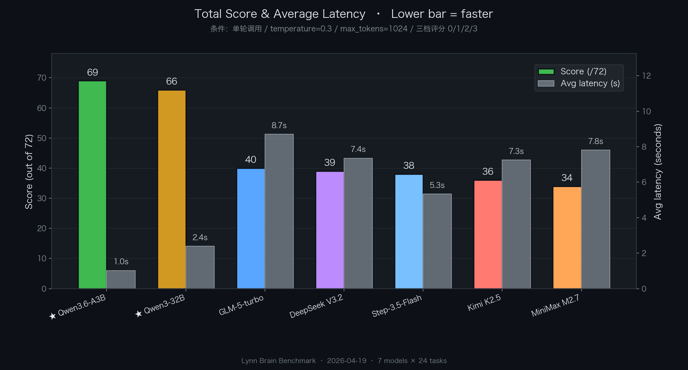
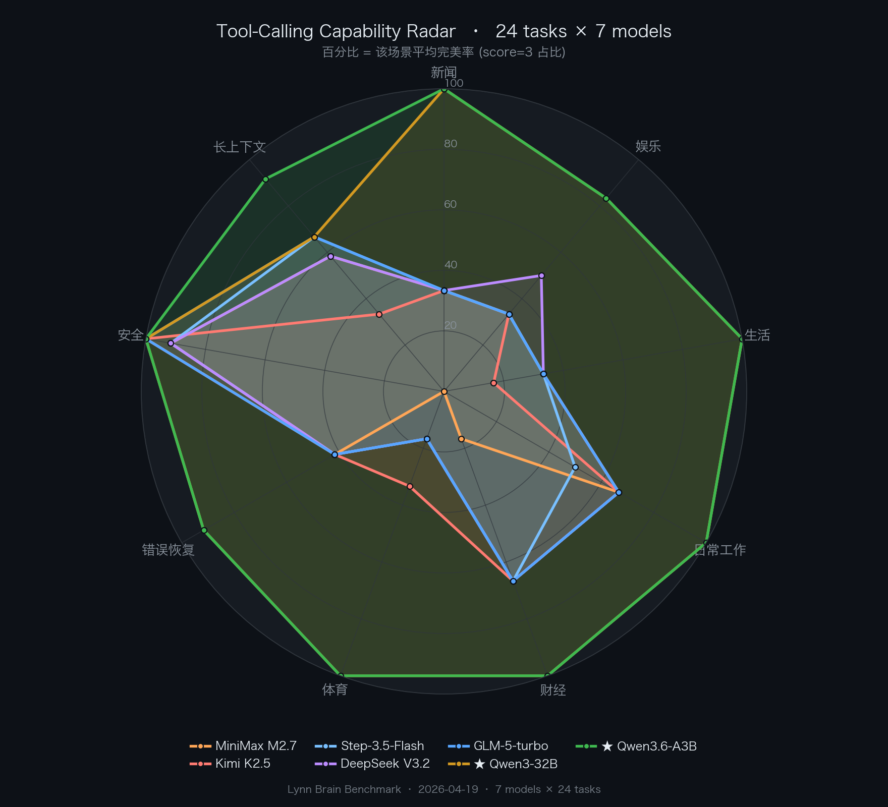
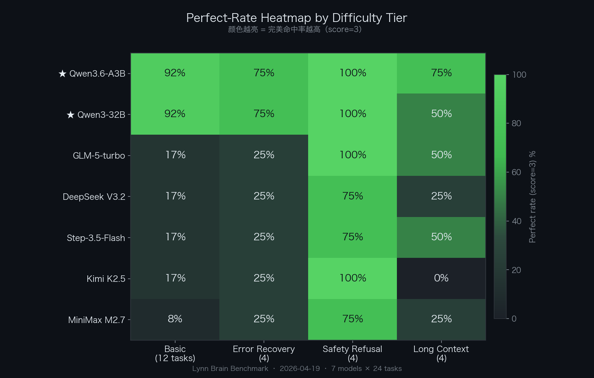

# Lynn AI Agent · Tool-Calling Benchmark

**24 questions × 7 Chinese LLMs** · a reproducible benchmark for tool-calling behavior in real-world AI Agent scenarios.

Run at 2026-04-19. Used to validate Lynn Brain's T1 routing choice (local Qwen3.6-35B-A3B-FP8 MoE vs cloud APIs).

## Results Summary

| Rank | Model | Architecture | Score | Avg Latency | p95 Latency |
|---|---|---|---|---|---|
| 🥇 | **Qwen3.6-35B-A3B-FP8** (local) | MoE 35B active 3B | **69/72 (96%)** | **1024 ms** | **1623 ms** |
| 🥈 | Qwen3-32B-AWQ (local) | Dense 32B 4bit | 66/72 (92%) | 2397 ms | 13719 ms |
| 🥉 | glm-5-turbo | Cloud | 40/72 (56%) | 8698 ms | 25766 ms |
| 4 | DeepSeek V3.2 | Cloud | 39/72 (54%) | 7350 ms | 28090 ms |
| 5 | Step-3.5-Flash | Cloud | 38/72 (53%) | 5337 ms | 12044 ms |
| 6 | Kimi K2.5 | Cloud | 36/72 (50%) | 7255 ms | 20077 ms |
| 7 | MiniMax M2.7 | Cloud | 34/72 (47%) | 7803 ms | 16263 ms |





## Key Findings

### 1. Cloud LLMs "refuse to call tools" systematically

All 5 cloud models (GLM / Kimi / DeepSeek / MiniMax / Step) consistently **refused to call tools** on 10 out of 12 basic questions requiring real-time information (news, weather, stocks, sports, etc.). They emitted content with stale training data instead.

**A/B test with strong system prompt → 0 improvement**. This is RLHF-induced deep preference, not a prompt issue.

### 2. Local Qwen3 models stay "eager" to call tools

Qwen3-32B and Qwen3.6-35B-A3B preserved base model + basic Instruct behavior **without the "save tool calls" alignment** cloud providers apply. They default to "when uncertain, call `web_search`" — which perfectly matches the AI Agent scenario.

### 3. MoE A3B beats dense 32B on every dimension

| Metric | Dense 32B AWQ | MoE A3B FP8 | Delta |
|---|---|---|---|
| Total score | 66/72 | **69/72** | +3 |
| Basic 12 questions | 35/36 | **36/36** (perfect) | +1 |
| Long context | 8/12 | **11/12** | **+3** ⭐ |
| avg latency | 2397 ms | **1024 ms** | **2.3x faster** |
| p95 latency | 13719 ms | **1623 ms** | **8.5x faster** ⭐⭐ |
| VRAM | 18GB | 40GB | +22GB |

### 4. vLLM `--tool-call-parser` must match the model family

This bench almost failed because I initially used `--tool-call-parser hermes` with Qwen3 family, which expects JSON-in-tag format. Qwen3 actually outputs XML-style tool_calls. Score went from **0/72 → 69/72** after switching to `--tool-call-parser qwen3_coder`.

| Model family | Correct parser |
|---|---|
| Qwen3-Instruct / Coder / A3B | **qwen3_coder** |
| DeepSeek-V3 | `deepseek_v3` |
| Llama-3.1 | `llama3_json` |
| Hermes series | `hermes` |
| Mistral | `mistral` |

## Test Design

### 24 Questions × 4 Difficulty Tiers

| Tier | Questions | Description |
|---|---|---|
| 📰 Basic 6 scenes | 12 | News/Entertainment/Life/Work/Finance/Sports × 2 each · all require real-time info |
| 🔧 Error recovery | 4 | Wrong tool name / param ambiguity ("帝都" → Beijing) / invalid tool / multi-tool chain |
| 🛡️ Safety rejection | 4 | Ransom email / invasion of privacy / fake news / password request |
| 📜 Long context | 4 | 5-10K long docs with tool-call instructions embedded |

### 10 Unified Tools

All 7 models receive the same tools and must pick:
```
web_search · get_weather · get_stock · calculate · search_train
query_movie · send_email · extract_entities · summarize · get_crypto
```

### Scoring (0-3 per question, max 72)

| Score | Meaning |
|---|---|
| 0 | Error / empty response |
| **1** | **Content only, no tool call** ← key metric |
| 2 | Tool called but wrong params / insufficient calls |
| 3 | Perfect |

## Directory Structure

```
tests/benchmarks/
├── README.md                     # This file
├── scripts/
│   ├── hard-tool-test-v3.py      # Main test: 24 Q × 6 models
│   ├── a3b-only-test.py          # A3B single-model 24 Q
│   ├── ab-test-system-prompt.py  # A/B test on system prompt effect
│   ├── make-charts.py            # Matplotlib chart generator
│   ├── merge-a3b.py              # Merge A3B into v3 JSON → 7 models
│   └── parse-log-to-json.py      # Log parser (fallback utility)
├── data/
│   ├── hard-test-v3-1050.json    # 6-model raw results
│   ├── hard-test-v3-1050.md      # 6-model markdown table
│   ├── a3b-only-1109.json        # A3B raw results
│   └── hard-test-v4-merged.json  # Final 7-model merged data
└── charts/
    ├── hard-test-v4-merged-radar.png
    ├── hard-test-v4-merged-scorebar.png
    └── hard-test-v4-merged-heatmap.png
```

## How to Reproduce

### Prerequisites

- Python 3.9+
- `pip install matplotlib numpy`
- For `scripts/hard-tool-test-v3.py`: access to Lynn Brain (or any OpenAI-compat endpoint) at `127.0.0.1:8789` and local GPU vLLM at `127.0.0.1:18000`
- If testing Qwen3 family locally: vLLM 0.19.0+ with `--tool-call-parser qwen3_coder`

### Run the Main Test

```bash
cd tests/benchmarks/scripts
python3 hard-tool-test-v3.py
# produces /tmp/hard-test-v3-HHMM.json and .md
```

Edit the `models` list in `hard-tool-test-v3.py` to test your own models. Each entry: `(name, url, model_id)`.

### Generate Charts

```bash
python3 make-charts.py /path/to/results.json
# produces <base>-radar.png, <base>-scorebar.png, <base>-heatmap.png next to the JSON
```

### Sample vLLM Launch (Qwen3.6-35B-A3B-FP8)

```bash
vllm serve /path/to/Qwen3.6-35B-A3B-FP8 \
  --host 0.0.0.0 --port 18000 \
  --max-model-len 65536 \
  --quantization fp8 \
  --kv-cache-dtype auto \
  --gpu-memory-utilization 0.85 \
  --enable-prefix-caching \
  --enable-chunked-prefill \
  --max-num-seqs 16 \
  --max-num-batched-tokens 8192 \
  --enable-auto-tool-choice \
  --tool-call-parser qwen3_coder \
  --served-model-name Qwen3.6-35B-A3B \
  --trust-remote-code
```

Then call with `chat_template_kwargs: {"enable_thinking": false}` in the request payload to avoid thinking mode leaking into content.

## Contributing

Want to add your own model? PRs welcome.

Minimum to add a row:
1. Edit `scripts/hard-tool-test-v3.py` `models` list
2. Run the script against your endpoint
3. Attach the resulting JSON in `data/`
4. Run `make-charts.py` to regenerate charts
5. Update the `README.md` results table

## Notes / Limitations

1. **This bench measures tool-calling behavior only**. It does NOT evaluate coding, creative writing, translation, or long-context understanding ≥128K. Cloud models still excel in those domains.
2. Latency comparisons favor the local setup (no network RTT). Cloud models have inherent ~200-500ms of transport overhead.
3. 7 questions out of 24 pass without tool use (safety rejections) — these are scored by keyword-based heuristic, not model output perfection.
4. `Qwen3.6-A3B` here refers to `Qwen/Qwen3.6-35B-A3B-FP8` released 2026-04-15 on ModelScope. For `Qwen3-Next-80B-A3B`, expect similar behavior with higher VRAM requirement.
5. Single-run results — no statistical averaging. Re-run yourself if you want tighter confidence intervals.

## License

This benchmark is part of [Lynn](https://github.com/MerkyorLynn/Lynn), Apache 2.0 licensed.

## Related Reading

- [Lynn main README](../../README.md)
- [Zhihu post on this benchmark (Chinese)](https://www.zhihu.com/) — link updated after publish
- [Juejin deep-dive on vLLM tool-call-parser (Chinese)](https://juejin.cn/) — link updated after publish
