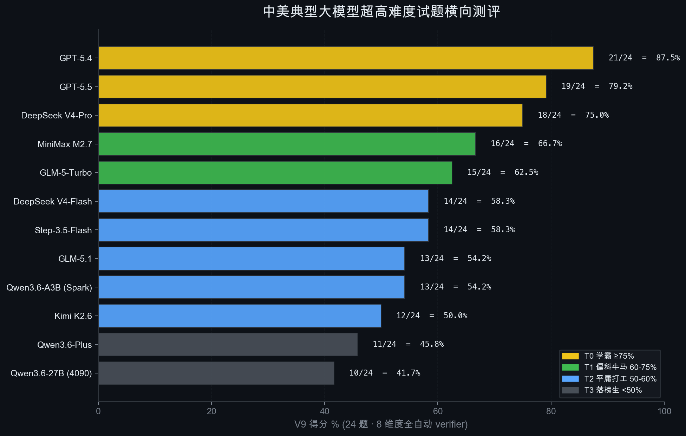
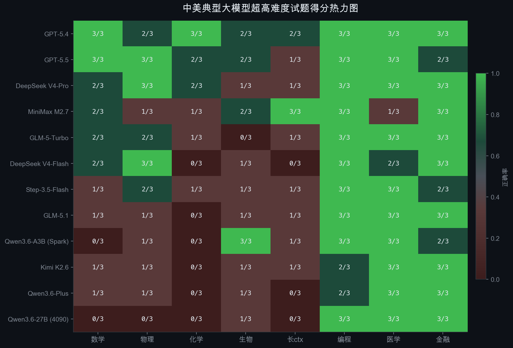
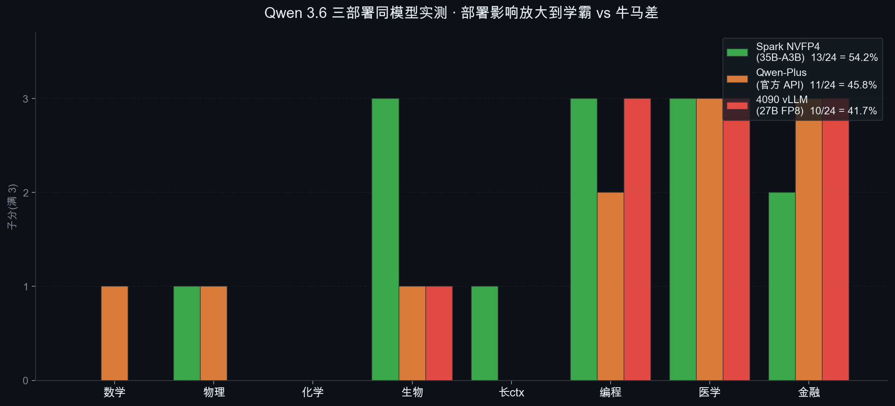
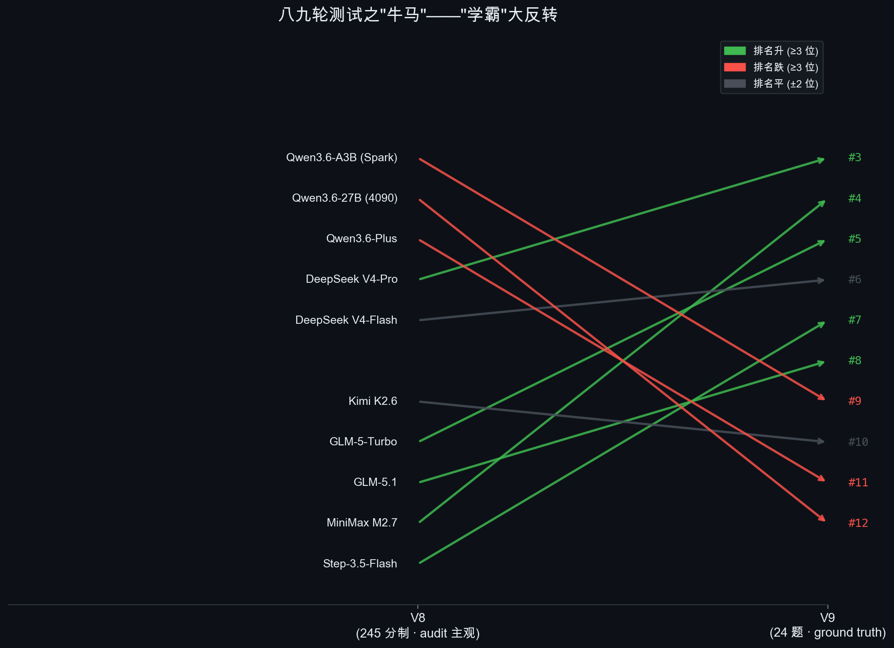

# V9 · 中美典型大模型超高难度试题横向测评

**12 家 LLM × 8 维度 × 24 题** · 100% 自动 ground-truth verifier · 0% 主观审分 · 任何人复现得同分。

跑于 2026-04-25 / 2026-04-26 · 用于验证 Lynn brain 主路径 + fallback 链 chatOrder 的合理性,同时对比国内外 frontier 模型边界。

跟 [tests/benchmarks/](../) 平行 — 那个是 2026-04-19 的 V4 tool-calling benchmark(测路由是否会调工具)· **本 V9 测裸推理能力上限**。

## Final 排行榜(8 维度 24 题)



| Rank | Provider | Total | % | Tier |
|:-:|---|:-:|:-:|:-:|
| 🥇 | GPT-5.4 (Codex OAuth) | 21/24 | **87.5%** | T0 学霸 |
| 🥈 | GPT-5.5 (Codex OAuth) | 19/24 | 79.2% | T0 学霸 |
| 🥉 | DeepSeek V4-Pro | 18/24 | 75.0% | T0 学霸 |
| 4 | MiniMax M2.7 | 16/24 | 66.7% | T1 偏科牛马 |
| 5 | GLM-5-Turbo | 15/24 | 62.5% | T1 偏科牛马 |
| 6 | DeepSeek V4-Flash | 14/24 | 58.3% | T2 平庸打工 |
| 7 | Step-3.5-Flash | 14/24 | 58.3% | T2 平庸打工 |
| 8 | GLM-5.1 | 13/24 | 54.2% | T2 平庸打工 |
| 9 | Qwen3.6-A3B (DGX Spark NVFP4) | 13/24 | 54.2% | T2 平庸打工 |
| 10 | Kimi K2.6 | 12/24 | 50.0% | T3 落榜生 |
| 11 | Qwen3.6-Plus(官方 reasoner) | 11/24 | 45.8% | T3 落榜生 |
| 12 | Qwen3.6-27B (RTX 4090 vLLM) | 10/24 | 41.7% | T3 落榜生 |

顶 vs 底分差 **45.8 pp** · V8 同 12 家在 245 制下分差仅 30 分(< 15 pp)· **V9 把题升级到 hard 后,真区分度浮现**。

## 8 维度子分热力图



8 维度:
1. **数学** — AIME 2025 中后段(yentinglin/aime_2025)
2. **物理** — GPQA Diamond Physics
3. **化学** — GPQA Diamond Chemistry
4. **生物** — GPQA Diamond Biology
5. **长上下文** — LongBench v2 hard split (525K avg ctx, MC)
6. **编程算法** — HumanEval+ Hard(test 长度 top 50 抽 3)
7. **医学** — MedQA-USMLE 4-options(question length top 50 抽 3)
8. **金融** — 自定义 2024 Q4 真实财报数字推理

每维度 3 题 · 单题 5 分 · 总分 120 → 折算 % = total / 120 × 100.

## Qwen 3.6 三部署 · 12.5 pp 反差



V8 时三部署同分 219-224(中文综合题) · V9 题升级后:
- **Spark NVFP4 (35B-A3B)** → 54.2% (Tier 2)
- **官方 Plus reasoner API** → 45.8% (Tier 3)
- **4090 vLLM (27B Dense)** → 41.7% (Tier 3 末)

部署影响放大到学霸 vs 牛马级别。**Qwen 3.6 系列没有统一"真能力"** · 用什么硬件 + 引擎 + 参数,直接决定它落在哪档。

## 八九轮测试反转



V8 (245 制 · 中文综合)→ V9 (24 题 · ground truth) 排名大反转:
- **MiniMax T2 末 → V9 第 4** · 长 ctx 真王(3/3 全对)
- **Qwen3.6-27B (Spark) V8 #3 → V9 #9** · 题升级 reasoner 撑不住
- **DS V4-Pro V8 T1 → V9 T0** · 真 frontier 题硬反而显能力
- **Kimi K2.6 V8 T1 → V9 落榜** · 中文综合稳 / hard 推理弱

**V8 ≠ V9 · 测的不是同一件事** — V8 测"打工牛马筛选" · V9 测"学霸甄别"。

## 目录结构

```
v9-comprehensive/
├── README.md              # 本文件
├── article.md             # 完整文章 ~4500 字 · 适合阅读
├── v9-final.json          # 12 家 final ranking + 子分 JSON
├── data/                  # 24 题题库(8 个 *.json)
│   ├── aime3.json         # 数学 · AIME 2025 #11-15
│   ├── gpqa_physics3.json # 物理 · GPQA Diamond
│   ├── gpqa_chemistry3.json
│   ├── gpqa_biology3.json
│   ├── longbench3.json    # 长 ctx · LongBench v2 hard
│   ├── humaneval3.json    # 编程 · HumanEval+ test top 50
│   ├── medqa3.json        # 医学 · USMLE
│   └── finance3.json      # 金融 · 自定义 2024 Q4 财报
├── verifiers/             # 5 个 ground truth verifier(全自动 · selftest 全过)
│   ├── verifier_math.py   # sympy 数值 / 符号 simplify
│   ├── verifier_letter.py # MC A/B/C/D 抽取 + match
│   ├── verifier_code.py   # pytest 沙箱 + 15s timeout
│   ├── verifier_finance.py# 数字 + tolerance match
│   └── verifier_sql.py    # sqlglot AST normalize(本次未启用 · 太严)
├── scripts/               # harness + fetch + render
│   ├── harness_v9.py      # 主 harness(10 家云端 + 自部署)
│   ├── harness_v9_gpt5.py # GPT-5.4/5.5 Codex OAuth 单独
│   ├── fetch_phase1.py    # Phase 1 数据获取(AIME / GPQA / LongBench)
│   ├── fetch_phase2.py    # Phase 2 数据获取(HumanEval / Spider / MedQA / Finance)
│   └── render_v9.py       # 4 张图渲染(GitHub Dark 风)
└── charts/                # 4 张可视化 PNG
    ├── v9-leaderboard.png
    ├── v9-heatmap.png
    ├── v9-vs-v8.png
    └── qwen3-deployment.png
```

## 复现步骤

```bash
cd tests/benchmarks/v9-comprehensive

# 1. 装依赖(推荐 Python 3.11+ venv)
python3.11 -m venv .venv
source .venv/bin/activate
pip install datasets sympy sqlglot antlr4-python3-runtime==4.11 matplotlib

# 2. 拉数据(GPQA 需 HF token + 申请 license)
export HF_TOKEN=hf_xxx  # https://huggingface.co/settings/tokens
# 申请 GPQA 访问:https://huggingface.co/datasets/Idavidrein/gpqa
python scripts/fetch_phase1.py
python scripts/fetch_phase2.py

# 3. 验证 verifier(都应 selftest 全过)
python verifiers/verifier_math.py     # 11/11
python verifiers/verifier_letter.py   # 11/11
python verifiers/verifier_code.py     # 3/3
python verifiers/verifier_finance.py  # 7/7

# 4. 跑 harness(以 Qwen3.6-Plus 为例)
# 准备 .env 含 DASHSCOPE_KEY / DEEPSEEK_KEY / KIMI_CODING_KEY 等
export DASHSCOPE_KEY=sk-xxx
python scripts/harness_v9.py --provider "Qwen3.6-Plus" --all --runs 1

# 5. 跑 GPT-5(单独 OAuth · 需要 ~/.lynn/auth.json 含 openai-codex.access)
python scripts/harness_v9_gpt5.py --model gpt-5.4

# 6. 重新渲染图
python scripts/render_v9.py
```

## 配置约束(实战标准)

- **单题时限 5 min** — 超时 = 不会(实战用户没这个耐心)
- **禁用工具调用** — 测裸推理 · 不让模型偷取 sympy / web search
- **Temperature 0.3** — 稳定输出
- **N=1 跑** — 加 N=2 严格判定可减随机性 · 但成本翻倍 · 当前数据 N=1
- **Stream / Reasoner 兼容** — DS reasoner 必须 stream=True + max_tokens=32768(否则 content 返空)

## 已知局限

1. **SQL 维度被砍** — sqlglot syntactic verifier 太严 · 全 12 家 0/3 · 真 SQL exec 工程量大 · 留 V10
2. **编程工程没做** — SWE-Bench Verified Hard 沙箱(git checkout + 跑测试)需 V10
3. **24 题样本量偏小** — 单题 5 分占 4.2% · 一题运气波动影响排名 · V10 升 50/维度
4. **训练污染风险** — HumanEval+ / GPQA Diamond / MedQA 都是公开 benchmark · AIME 2025 较干净
5. **中文文学/创意没测** — V9 全用英文 / 通用知识题 · Qwen 系列的中文创作优势在 V8 测过

## 相关资料

- 完整文章:[`article.md`](article.md)(~4500 字 · 9 章 · 推荐阅读)
- V4 tool-calling benchmark:[../README.md](../README.md)(2026-04-19 · 24 题 7 LLM)
- Lynn 主项目:[../../../README.md](../../../README.md)

## License

题目原文版权归各自 dataset(Hugging Face / GBaker / 等)。Verifier / harness / charts 代码本仓库 MIT 协议。
